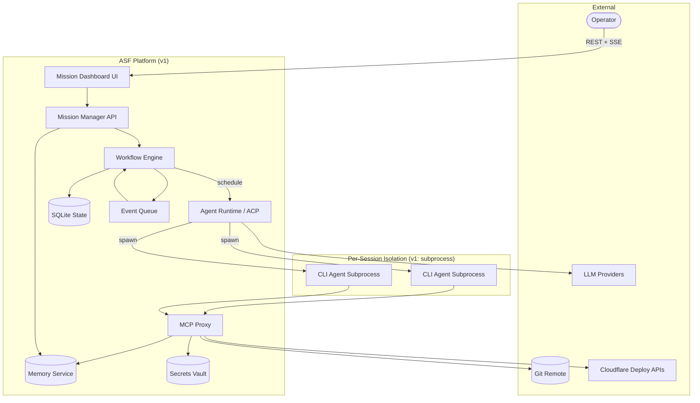
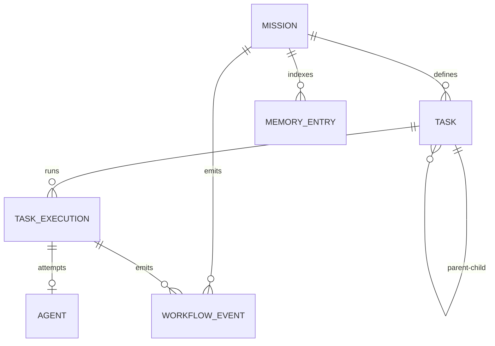
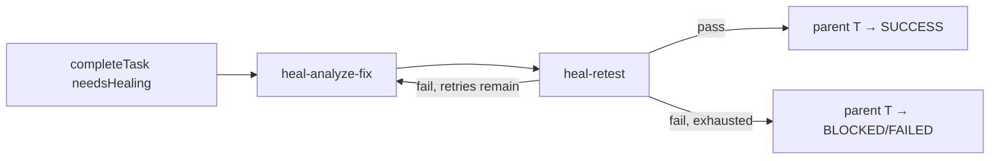
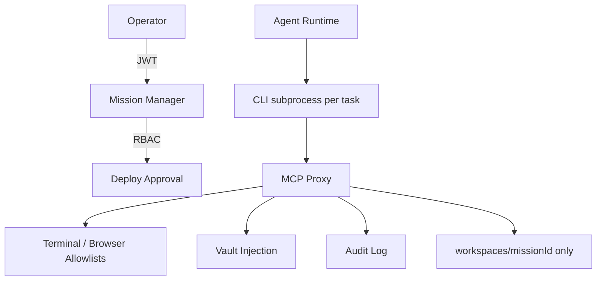
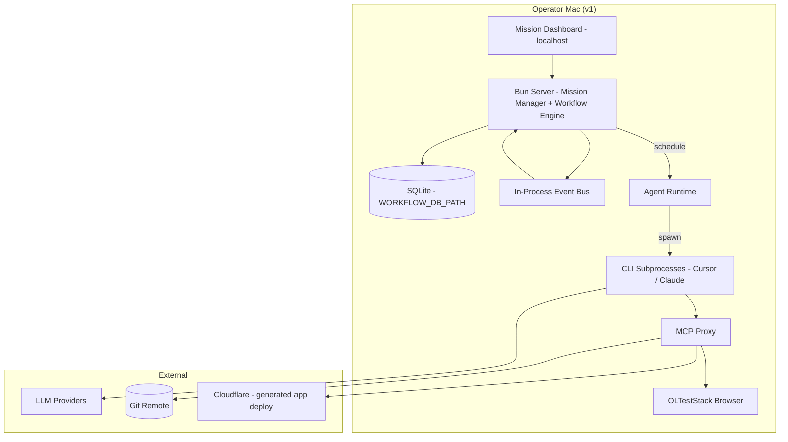
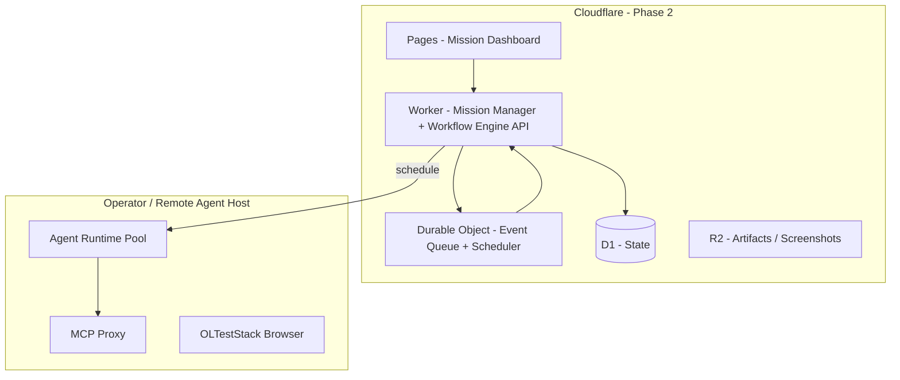

# ASF Architecture Design Document (ADD)

**Version:** 1.0.0  
**Status:** Engineering-ready  
**Date:** 2026-06-22  
**Supersedes:** Ambiguities in `requirements/02-proposed-architecture.md` (bootstrap sidecar, dual state machines)

---

## 1. Purpose

This document translates ASF product requirements into an implementable architecture. It resolves P0 review findings: single orchestrator, `TaskExecution` as sole runtime state, bootstrap phases as workflow tasks, verification-gated SUCCESS, and **v1 local-first deployment** (Bun + SQLite on the operator's Mac). See [ADR-001](./ADR-001-local-first-topology.md) and [ADR-002](./ADR-002-cli-agent-runtime.md).

---

## 2. System Context



**Context summary:** An operator submits a mission goal. The Mission Manager creates mission metadata and workspace; the Workflow Engine owns all task lifecycle. In v1, agents run as **CLI subprocesses** on the same Mac (ADR-002) and access the world only through the MCP Proxy. Durable state lives in **SQLite** on the operator machine. Events flow through an in-process queue for idempotent continuation. Cloudflare-hosted orchestrator is Phase 2 (ADR-001); Cloudflare remains a deploy target for generated apps.

---

## 3. Component Catalog

| Component | Responsibility | Primary FRs |
|-----------|----------------|-------------|
| **Mission Manager API** | Mission CRUD, pause/resume, production deploy approval, mission status derivation (read-only aggregate) | FR-01, FR-20 |
| **Workflow Engine** | Sole writer of `TaskExecution` status; scheduling; leases; continuation; healing child orchestration | FR-06, FR-15, FR-20, workflow-engine |
| **Agent Runtime (ACP)** | Spawn/terminate sessions; inject Context Bundle; collect `AgentResult`; heartbeat leases | FR-07, FR-08 |
| **MCP Proxy** | Session-scoped tool routing; allowlists; audit; vault injection at tool boundary | mcp-integration, security |
| **Memory Service** | Mission-scoped semantic memory (commits, search) | FR-18, FR-19 |
| **UI (Mission Dashboard)** | Mission/task/agent views; approval gates; workflow graph | user-interface |

### 3.1 Mission Manager API

- **Does:** Create missions, validate `mission.yaml`, expose REST + SSE progress stream, handle operator approvals (`DEPLOY_APPROVAL_REQUIRED`).
- **Does not:** Transition task states, spawn agents, or bypass Workflow Engine.

### 3.2 Workflow Engine

- **Does:** Persist workflow DAG, evaluate eligibility, assign agents, process `completeTask` / healing events, enforce idempotency, derive mission status.
- **Does not:** Execute agent logic or call LLMs directly.

### 3.3 Agent Runtime / ACP

- **Does (v1):** One CLI subprocess per execution attempt (`asf agent run`); bind MCP Proxy; enforce timeouts; translate `AgentResult` → engine events. See [ADR-002](./ADR-002-cli-agent-runtime.md).
- **Does (Phase 2+):** Optional container-per-session on remote agent hosts for multi-tenant isolation.
- **Does not:** Mutate `TaskExecution.status` directly.

### 3.4 MCP Proxy

- **Does:** Enforce per-agent tool allowlists (see [agent-contracts.md](./agent-contracts.md)), workspace path jail, terminal/browser allowlists per [security.md](../requirements/framework/security.md).
- **Does not:** Store long-term workflow state.

---

## 4. Data Model

### 4.1 Design Principle: Task vs TaskExecution

Reviews identified **dual state machines** (Task entity status vs Agent lifecycle vs implicit bootstrap pipeline). v1 resolves this:

| Entity | Role | Mutable By |
|--------|------|------------|
| **Task** | Planner-defined specification (type, deps, acceptance criteria) | Planner (at plan time only) |
| **TaskExecution** | Runtime state machine — **single source of truth** | Workflow Engine only |
| **Agent** | Execution attempt record bound to one `TaskExecution` | Agent Runtime (lifecycle); status outcome reported to Engine |

`Task.status` in UI is a **projection** of the latest `TaskExecution.status` for that `taskId`.

### 4.2 Entity Schemas (Conceptual)

```typescript
interface Mission {
  id: string;
  goal: string;
  constraints: MissionConstraints;
  status: MissionStatus; // derived, cached on Mission row
  workspacePath: string;
  contractVersions: Record<string, string>; // agent type → version
  createdAt: string;
  completedAt?: string;
}

interface Task {
  id: string;
  missionId: string;
  type: TaskType;
  title: string;
  description: string;
  assignedAgentType: string;
  dependencies: string[]; // task IDs
  acceptanceCriteria: string[];
  parallelSafe?: boolean;
  maxRetries?: number;
  epicId?: string;
  parentTaskId?: string; // set for healing-child tasks
  gateType?: GateType; // merge | test | deploy | verify
}

interface TaskExecution {
  id: string;
  taskId: string;
  missionId: string;
  attempt: number; // 1-based
  status: TaskExecutionStatus;
  agentId?: string;
  acpSessionId?: string;
  leaseExpiresAt?: string;
  idempotencyKey: string;
  result?: AgentResult;
  failureReportId?: string;
  startedAt?: string;
  completedAt?: string;
}

interface Agent {
  id: string;
  type: string;
  taskExecutionId: string;
  status: AgentStatus; // CREATED | ASSIGNED | RUNNING | COMPLETED | FAILED | BLOCKED
  acpSessionId?: string;
  tokenUsage?: { input: number; output: number };
  durationMs?: number;
}

interface WorkflowEvent {
  id: string;
  type: string;
  missionId: string;
  payload: Record<string, unknown>;
  idempotencyKey: string;
  createdAt: string;
}
```

### 4.3 Task Types (v1)

**Bootstrap (first-class workflow tasks — not sidecar):**

| Type | Agent |
|------|-------|
| `discover-requirements` | requirement-discovery |
| `research` | research |
| `architecture` | architect |
| `plan-tasks` | planner |

**Implementation & delivery:**

| Type | Agent |
|------|-------|
| `setup-repo` | infra-engineer |
| `schema-migration` | backend-engineer |
| `implement-backend` | backend-engineer |
| `implement-frontend` | frontend-engineer |
| `implement-infra` | infra-engineer |
| `write-tests` | testing |
| `browser-test` | testing |
| `deploy` | deployment |
| `verify-deployment` | verification |

**Healing (child tasks):**

| Type | Agent |
|------|-------|
| `heal-analyze-fix` | fix |
| `heal-retest` | testing |

### 4.4 ER Diagram



### 4.5 Mission Status Derivation

Cached on `Mission.status`, recomputed on every `TaskExecution` terminal transition:

| Condition | Mission Status |
|-----------|----------------|
| All tasks' latest execution `SUCCESS` **and** `verify-deployment` execution `SUCCESS` with FR-17 `status: verified` | `SUCCESS` |
| Any latest execution `BLOCKED`, none `RUNNING` | `BLOCKED` |
| Any latest execution `FAILED` (retries exhausted) | `FAILED` |
| Any `RUNNING` or eligible `PENDING` | `RUNNING` |
| Mission created, no execution started | `PENDING` |

---

## 5. API Boundaries

### 5.1 Decision: REST Control Plane + Internal Event Queue

| Surface | Protocol | Consumers |
|---------|----------|-----------|
| Mission Manager API | REST + SSE | UI, CLI, operators |
| Workflow Engine API | REST (internal) | Mission Manager, Agent Runtime |
| Agent Runtime → Engine | REST `completeTask`, `heartbeat` | Workflow Engine |
| Continuation / scheduling | **Internal event queue** (Bun in-process bus in v1; Durable Object queue in Phase 2) | Workflow Engine worker |

**Rationale:** REST gives debuggable, versioned contracts for UI and operators. High-frequency continuation (`task.completed` → `scheduleTasks`) uses an internal queue with at-least-once delivery and idempotency keys — not public webhooks in v1.

### 5.2 Public REST Endpoints (Mission Manager)

```
POST   /v1/missions                    # FR-01
GET    /v1/missions/:id
POST   /v1/missions/:id/pause
POST   /v1/missions/:id/resume
POST   /v1/missions/:id/approve-deploy   # production gate
GET    /v1/missions/:id/tasks
GET    /v1/missions/:id/events         # SSE stream
GET    /v1/missions/:id/workflow-graph
```

### 5.3 Internal Workflow Engine Endpoints

All internal endpoints require service authentication (see §10.1). Path parameter `:taskExecutionId` is the runtime execution row ID, not the planner `taskId`.

```
POST   /internal/v1/missions/:id/start
POST   /internal/v1/tasks/:taskExecutionId/complete   # idempotencyKey required
POST   /internal/v1/tasks/:taskExecutionId/heartbeat
POST   /internal/v1/schedule                            # idempotencyKey required
GET    /internal/v1/missions/:missionId/eligible-tasks
```

Event catalog and JSON schemas: [workflow-dsl.md](./workflow-dsl.md). Entity schemas: [`requirements/schemas/`](../requirements/schemas/).

---

## 6. Orchestration Decision

### 6.1 Options Considered

| Option | Pros | Cons |
|--------|------|------|
| **Temporal** | Battle-tested durability, leases, replay | Ops overhead, worker fleet, learning curve for small team |
| **Inngest** | Serverless-friendly, step functions | Less control over custom DAG/healing model; vendor coupling |
| **Custom engine on D1 + queue** | Exact fit for TaskExecution model, minimal deps, Cloudflare-native | Must implement leases/idempotency ourselves |

### 6.2 Recommendation (v1): **Custom Workflow Engine**

**Opinionated choice:** Build a **custom durable state machine** backed by **SQLite (v1)** with lease columns on `TaskExecution`, an in-process event queue, and crash-recovery sweeper. D1 adapter deferred to Phase 2 (ADR-001).

**Rationale:**

1. ASF's model is a **DAG of typed tasks with healing children and gate nodes** — not general-purpose workflows. Mapping to Temporal activities adds indirection without v1 benefit.
2. v1 is **single-orchestrator, single-tenant staging** — complexity budget favors one Bun/Worker service over a Temporal cluster.
3. P0 requirements already specify engine behavior (sole writer, leases, idempotency) — v1 scope is a **focused state machine** (transitions, scheduling, healing children, merge gates), not a general workflow product. Expect **~2–4k LOC** for core engine + tests; merge queue, gate runners, and crash sweeper add surface beyond a minimal FSM.
4. **Migration path:** If multi-region or cross-mission sagas emerge (P2), extract scheduling to Temporal behind the same `completeTask` / `scheduleTasks` API.

Inngest is deferred: useful for cron/retry fan-out later, but redundant with our queue + engine in v1.

---

## 7. Bootstrap Phase as Workflow Tasks

P0 fix: discovery/architecture/planning are **not** Mission Manager side effects.

**Seed DAG** created at mission start (before planner output):


1. `POST /missions` creates mission + seed tasks `t-discover`, `t-research`, `t-architecture`, `t-plan`.
2. `startMission` schedules `t-discover`.
3. On `t-plan` SUCCESS, planner emits full `tasks/plan.json`; engine **merges** new tasks into DAG (same mission, new task rows).
4. `t-plan` dependencies satisfied → implementation tasks become eligible.

Planner merge semantics (collision policy, gate auto-materialization): [workflow-dsl.md §4.1](./workflow-dsl.md#41-planner-merge-semantics).

Planner merge is **additive** in v1 (no automatic re-plan during execution).

---

## 8. Self-Healing as Child Workflow

P0 fix: self-healing is **not** a sidecar loop inside the Agent Runtime.

**Canonical ingress:** Agent Runtime calls `completeTask` with `needsHealing: true` or `FAILED` + `recoverable: true`. The Workflow Engine:

1. Persists `failure.detected` event (audit only — does not trigger a second heal).
2. Creates **healing child subgraph** under parent task `T` (`parentTaskId = T`).
3. Dedup key: `heal:{taskExecutionId}:{failureReportId}`.

Child sequence (hard edges):



4. `heal-analyze-fix` → Fix Agent; `heal-retest` → Testing Agent (minimum failed suite).
5. Iteration count increments `TaskExecution.attempt` on parent; FR-15 `maxRetries` applies to healing cycles.
6. Healing **cannot** skip `verify-deployment` or mark mission SUCCESS.

DSL node type: `healing-child` — see [workflow-dsl.md](./workflow-dsl.md).

---

## 9. Git Concurrency Model

### 9.1 Branch Strategy (FR-10)

```
main                          # protected
└── mission/{missionId}       # integration branch
    └── task/{taskId}         # one branch per task execution
```

### 9.2 Rules

1. Agent checks out `task/{taskId}` at session start (from `mission/{missionId}`).
2. On task SUCCESS, **merge gate** node runs: `bun test`, lint, typecheck, secret-scan.
3. Merge `task/{taskId}` → `mission/{missionId}` via merge queue (serial per mission).
4. On mission SUCCESS, merge `mission/{missionId}` → `main` (single merge gate).

### 9.3 Shared-Surface Serialization (FR-05)

Tasks touching `package.json`, root app entry, or `openapi.yaml` get `parallelSafe: false` (default). Workflow Engine will not schedule them concurrently even if deps allow.

### 9.4 Merge Queue (v1 Lightweight)

Per-mission FIFO queue:

```
enqueue(taskId) on task SUCCESS
worker: pop → run merge_gate → git merge → emit gate.completed | gate.failed
```

Conflicts → parent task `BLOCKED` with conflict file list for Fix Agent or operator.

---

## 10. Security Architecture

Implements [requirements/framework/security.md](../requirements/framework/security.md).

### 10.1 Internal API Authentication

All `/internal/v1/*` endpoints MUST reject unauthenticated callers.

| Mode | v1 Local-First (Mac) | Phase 2 (Worker ↔ remote agents) |
|------|---------------------|----------------------------------|
| **JWT** | Short-lived service token (`aud: asf-internal`, `sub: agent-runtime` \| `system`) signed with platform secret; `Authorization: Bearer` | Same; rotated via vault |
| **mTLS** | Optional between co-located API and agent-runtime processes | Recommended for remote Agent Runtime pool |

- Mission Manager and Agent Runtime are the only authorized callers.
- Tokens MUST NOT be passed to agent subprocesses or Context Bundles.
- Failed auth → `401` with no body leakage.

### 10.2 Deploy Approval Token Binding

Production deploy approval (`POST /v1/missions/:id/approve-deploy`) issues a one-time approval JWT bound to:

```json
{
  "jti": "apr-uuid",
  "missionId": "m-uuid",
  "deployTaskId": "t-deploy",
  "taskExecutionId": "te-uuid",
  "environment": "production",
  "commitSha": "abc1234",
  "approvedBy": "operator-user-id",
  "exp": 1700000000
}
```

Deployment Agent MUST present this token to `deployment.deploy`; MCP Proxy validates `missionId`, `deployTaskId`, and `commitSha` match the pending execution.

### 10.3 Agent Egress Policy (v1: MCP-Mediated)

Per-session CLI subprocesses (§3.3 Agent Runtime) do not have container network policies. External access is **only** via MCP Proxy tools:

| Egress | Allowed (via MCP) | Blocked |
|--------|-------------------|---------|
| LLM APIs | Direct from subprocess env (operator API keys) | — |
| Package registries | Terminal allowlist: `bun install`, etc. | Arbitrary download URLs |
| Git | `git` MCP / terminal allowlist | Unknown remotes |
| Deploy APIs | Cloudflare via deployment tools | Production without approval token |
| Browser | OLTestStack proxy only | Direct internet |
| Web MCP | See security.md Web allowlist | SSRF targets |

Non-allowlisted MCP tool calls MUST fail closed.



| Control | Implementation |
|---------|----------------|
| Isolation | Process + workspace path jail; MCP allowlists (ADR-002) |
| Secrets | `vault.get(secretRef, sessionId)` at MCP boundary; never in Context Bundle |
| Production deploy | `POST /approve-deploy` required; `DEPLOY_APPROVAL_REQUIRED` otherwise |
| Terminal | Prefix allowlist: `bun`, `wrangler`, `git`, etc. |
| Browser | URL allowlist: deploy URLs, localhost, `constraints.verification.allowedHosts` |
| RBAC | `operator`, `viewer`, `system` roles (v1 single-tenant) |

---

## 11. Deployment Topology (v1)

> **v1 default:** Local-first on the operator's Mac. [ADR-001](./ADR-001-local-first-topology.md) supersedes the split Cloudflare + Docker control plane for v1. Engine and API contracts (§5) are unchanged.

### 11.1 v1 Deployment Topology (Local-First)

**Supersedes** the former §11.1 split topology (Worker ↔ Docker) for all v1 work.



| Component | v1 Implementation |
|-----------|-------------------|
| **Control plane** | Single Bun process (or co-located services on `127.0.0.1`) — see `packages/workflow-engine` |
| **State** | SQLite file; schema matches engine spike |
| **Queue / sweeper** | In-process bus + `setInterval` lease sweeper |
| **UI** | Local static assets or dev server; SSE to `GET /v1/missions/:id/events` |
| **Agents** | `asf agent run` subprocess per task — [ADR-002](./ADR-002-cli-agent-runtime.md) |
| **MCP / browser** | Co-located MCP Proxy + OLTestStack on same host |
| **Secrets** | macOS Keychain / env-encrypted local vault (OD-1) |

**Operator workflow:**

```bash
asf serve                    # Bun API + engine + agent runtime + MCP proxy
# or: bun run --cwd packages/workflow-engine server  # engine spike today
```

No Docker required for v1 agent execution. Optional `docker compose up workflow-engine` persists SQLite for CI only.

### 11.2 Phase 2: Hosted Control Plane (Cloudflare) — Deferred

Former ADD §11.1 production topology. **Not in v1 scope** for the ASF orchestrator.



- **UI:** Cloudflare Pages (static + API proxy).
- **API + Engine:** Cloudflare Worker.
- **Queue / lease sweeper:** Durable Object with alarm for orphaned `RUNNING`.
- **State:** D1 (storage adapter behind same engine contracts).
- **Agents:** Still on operator or remote host — CLI subprocesses (v1) or optional Docker pool (multi-tenant).

Migration path: [ADR-001 § Migration Path](./ADR-001-local-first-topology.md#migration-path-local--phase-2-hosted).

### 11.3 Deploy Targets for Generated Apps (FR-16)

| Target | v1 |
|--------|-----|
| Cloudflare (Workers, Pages, D1) | ✅ |
| Docker / Compose | ✅ |
| K8s, AWS, Azure, GCP, VPS | ❌ future |

---

## 12. Crash Recovery & Idempotency

### 12.1 Lease Model

On `PENDING → RUNNING`:

1. Create `TaskExecution` with `leaseExpiresAt = now + 120s`.
2. Agent Runtime heartbeats every 30s → extends lease by `extendBySeconds` (default 120s).
3. Sweeper (in-process interval in v1; DO alarm in Phase 2): if `RUNNING` and `leaseExpiresAt < now` → `FAILED`, `classification: timeout`, recoverable.

**Lease vs agent timeout:** Heartbeat extends the execution lease but does **not** reset the agent wall-clock timeout from agent-contracts (e.g., 2h for backend-engineer). When wall-clock exceeds `timeout_ms`, Agent Runtime terminates the ACP session and reports `FAILED` + `timeout` even if lease was extended. Lease expiry covers crash/orphan detection; wall-clock covers runaway agents.

### 12.2 Orchestrator Restart

1. Load all `RUNNING` executions.
2. No valid lease → transition to `FAILED` (recoverable).
3. Emit `orchestrator.recovered`.
4. Call `scheduleTasks` (idempotent) for mission.

### 12.3 Idempotency Keys

| Operation | Key Format |
|-----------|------------|
| `completeTask` | `complete:{taskExecutionId}:{agentResultHash}` |
| `scheduleTasks` | `schedule:{missionId}:{triggerEventId}` |
| Event ingestion | `event:{eventId}` |

Duplicate keys return `200` with prior result — no double scheduling (FR-20).

### 12.4 Write Ordering

```
1. Persist TaskExecution transition (transaction)
2. Emit workflow event
3. Enqueue continuation
4. Side effects (spawn agent) — only after commit
```

---

## 13. Open Decisions

| # | Decision | Recommendation | Defer To |
|---|----------|----------------|----------|
| OD-1 | Vault backend | Cloudflare Secrets + env-encrypted local store for dev | Implementation |
| OD-2 | Container runtime | CLI subprocess v1 (ADR-002); Docker for multi-tenant / CI post-v1 | Implementation |
| OD-3 | LLM model per agent type | Config table in mission constraints; default single model v1 | Agent Contracts |
| OD-4 | Remote git push timing | Push on task SUCCESS to `task/{id}`; push mission branch on mission SUCCESS | FR-10 impl |
| OD-5 | Squash on merge to main | Yes — single squash merge per mission | FR-10 impl |
| OD-6 | Workflow versioning on re-plan | Not in v1; manual mission amendment only | P2 |
| OD-7 | Temporal migration | Revisit when >1 orchestrator region or cross-mission sagas | P2 |
| OD-8 | SSE vs WebSocket for UI | SSE for v1 (simpler on Workers) | Implementation |
| OD-9 | MCP transport | stdio for sidecar MCP servers; HTTP proxy from Agent Runtime | Implementation |
| OD-10 | Sub-tasks vs flat + parent pointer | Flat tasks + `parentTaskId` for healing (chosen) | — |

---

## 14. Acceptance Checklist (ADD)

- [ ] Component boundaries match diagram §2
- [ ] TaskExecution is sole runtime state writer
- [ ] Bootstrap tasks in seed DAG
- [ ] Healing modeled as child tasks
- [ ] Mission SUCCESS requires verify-deployment + FR-17 verified
- [ ] Git branch-per-task + merge queue documented
- [ ] Security references security.md controls
- [ ] v1 deploy: local-first Mac topology (ADR-001) + Cloudflare/Docker app targets
- [ ] v1 agents: CLI subprocess runtime (ADR-002), not Docker
- [ ] Custom engine choice documented with migration path

---

## Related Documents

- [ADR-001-local-first-topology.md](./ADR-001-local-first-topology.md)
- [ADR-002-cli-agent-runtime.md](./ADR-002-cli-agent-runtime.md)
- [workflow-dsl.md](./workflow-dsl.md)
- [agent-contracts.md](./agent-contracts.md)
- [requirements/reviews/cross-review-synthesis.md](../requirements/reviews/cross-review-synthesis.md)
- [reviews/cross-review-synthesis.md](./reviews/cross-review-synthesis.md)
