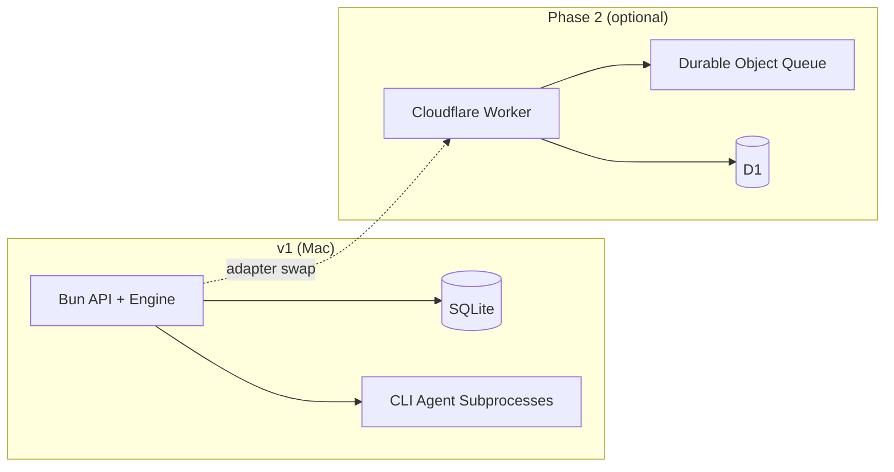

# ADR-001: Local-First Control Plane Topology

**Status:** Accepted  
**Date:** 2026-06-22  
**Deciders:** ASF architecture pivot (operator Mac as sole v1 host)  
**Supersedes:** ADD §11.1 as the v1 default deployment model

---

## Context

The original ADD assumed a **split topology**: Cloudflare Workers + Durable Objects + D1 as the production control plane, with agents running in Docker on an operator host. That model optimizes for a hosted, remotely reachable orchestrator but adds early complexity:

- Worker ↔ Docker connectivity, auth, and scheduling latency
- D1/Durable Object operational surface before the workflow engine is proven
- Two deployment paths (Compose local vs Cloudflare production) diverging from day one

The workflow engine spike (`packages/workflow-engine`) already runs as a **Bun HTTP server with SQLite**, implementing the same `/internal/v1/*` contracts documented in ADD §5. The operator's Mac is the natural v1 host: missions, workspaces, LLM credentials, and browser automation (OLTestStack) all live on one machine.

Cloudflare remains valuable as a **deploy target for generated applications** (Workers, Pages, D1) — not as the ASF control plane in v1.

---

## Decision

**v1 control plane runs entirely on the operator's Mac:**

| Layer | v1 Choice |
|-------|-----------|
| **Orchestrator** | Bun server — Mission Manager API + Workflow Engine (single process or co-located services) |
| **State** | SQLite file (`WORKFLOW_DB_PATH`, default under `~/.asf/` or mission workspace) |
| **Event queue** | In-process bus (Bun) with at-least-once continuation + idempotency keys |
| **Lease sweeper** | Local cron / `setInterval` alarm in the same process |
| **UI** | Local dev server or static assets served by the Bun API (`127.0.0.1`) |
| **Agent host** | Same machine — subprocess model per ADR-002 (no Docker for agent execution) |

**Cloudflare control plane is deferred to Phase 2** (optional hosted orchestrator for teams that want remote dashboards or multi-operator access).

**Cloudflare deploy targets for generated apps remain in v1 scope** (FR-16): the Deployment Agent may still call `wrangler`, provision D1, and publish Pages/Workers for mission output.

---

## Consequences

### Positive

- **Single binary mental model:** `asf serve` (or equivalent) starts the full control plane; no Worker ↔ Docker split auth.
- **Faster iteration:** SQLite file is inspectable; no remote D1 migrations during engine development.
- **Contract stability:** REST + SSE APIs, `TaskExecution` state machine, and idempotency keys are unchanged — only the hosting substrate differs.
- **Natural fit for solo operator:** Credentials, git remotes, and Chromium for browser tests stay on the host the user already trusts.

### Negative

- **No remote mission dashboard** without tunneling (ngrok, Tailscale) or waiting for Phase 2.
- **Single point of failure:** Mac sleep, disk loss, or process kill affects the only orchestrator; mitigated by SQLite persistence and crash recovery (ADD §12).
- **Not multi-tenant:** one operator, one ASF instance — acceptable for v1 per requirements scope.

### Neutral

- Engine code should remain **portable**: D1 and Durable Objects become storage/queue adapters in Phase 2, not a rewrite of scheduling logic.
- Docker Compose may still wrap the **workflow engine** for CI or optional persistence; it is not the v1 default for operators.

---

## Alternatives Considered

| Alternative | Why Rejected for v1 |
|-------------|---------------------|
| **Cloudflare-first (original ADD §11.1)** | Premature split topology; engine not yet validated at scale; blocks local-only development story |
| **Docker Compose as v1 default** | Adds container ops overhead without isolation benefit when agents are CLI subprocesses (ADR-002) |
| **Temporal / Inngest hosted orchestrator** | ADD §6.2 already defers; local custom engine is sufficient for single-machine DAG |
| **Drop Cloudflare entirely** | Rejected — generated apps still target Workers/Pages/D1; only the *orchestrator* moves local |

---

## Migration Path (Local → Phase 2 Hosted)

When Phase 2 Cloudflare control plane is needed:

1. **Extract storage interface** — `WorkflowStore` with SQLite (v1) and D1 (Phase 2) implementations; same SQL schema where possible.
2. **Extract queue interface** — in-process bus → Durable Object alarm + internal queue; preserve idempotency key formats (ADD §12.3).
3. **Agent runtime stays on operator host** until multi-tenant SaaS — Worker schedules via authenticated callback to local `agent-runtime` or future remote pool.
4. **UI** — Pages front-end proxies to Worker API; local `127.0.0.1` mode remains for development.

No migration required for **mission workspaces**, **git history**, or **generated app deploys** — only orchestrator state moves to D1 if the operator opts into hosted mode.

---

## References

- [ADD.md §11 — v1 Deployment Topology (Local-First)](./ADD.md#11-deployment-topology-v1)
- [ADR-002 — CLI Agent Runtime](./ADR-002-cli-agent-runtime.md)
- [packages/workflow-engine/README.md](../packages/workflow-engine/README.md)
