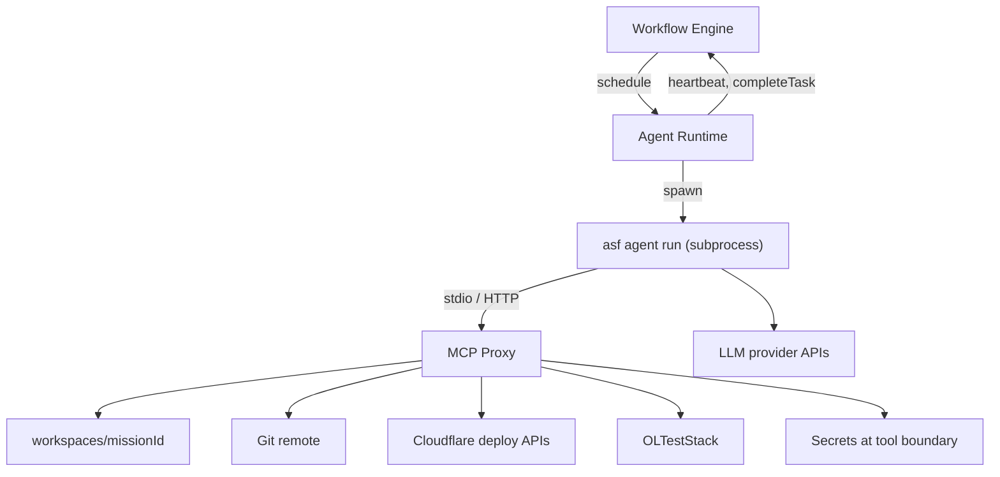

# ADR-002: CLI Agent Runtime (No Docker in v1)

**Status:** Accepted  
**Date:** 2026-06-22  
**Deciders:** ASF architecture pivot (local-first single machine)  
**Supersedes:** ADD §3.3 container-per-session model for v1 agent execution

---

## Context

The original ADD modeled the Agent Runtime (ACP) as **one Docker container per execution attempt**, with egress policy enforced at the container network boundary and MCP servers as sidecars. That design targets:

- Strong isolation between concurrent agent sessions
- Remote agent pools reachable from a Cloudflare Worker orchestrator
- Reproducible toolchains via pinned images

For v1 on a **single operator Mac**, Docker adds friction without matching the actual agent model: Cursor CLI, Claude Code, and similar tools are **already local processes** with their own sandboxing, MCP configuration, and operator-approved credentials. Running them inside containers means socket mounts, GPU passthrough, and duplicated MCP wiring — complexity that does not improve safety for a single-tenant, single-user machine.

The workflow engine already schedules tasks and expects `AgentResult` via `completeTask`; only the **spawn mechanism** changes.

---

## Decision

**v1 agent execution uses CLI subprocesses — no Docker for agent runs.**

| Concern | v1 Approach |
|---------|-------------|
| **Spawn** | `asf agent run --task-execution <id>` — one subprocess per task attempt |
| **Agent backends** | Cursor Agent CLI, Claude Code, or stub agents (spike) — pluggable via `agent type → command template` |
| **Isolation** | OS process boundaries + workspace path jail + MCP Proxy allowlists (not containers) |
| **MCP** | Parent Agent Runtime spawns MCP Proxy; agent CLI connects via stdio or local HTTP proxy |
| **Context** | Context Bundle injected via env file / temp JSON (never includes internal JWT or vault secrets) |
| **Lifecycle** | Agent Runtime monitors stdout/stderr, heartbeats to engine, enforces wall-clock timeout (agent-contracts) |
| **Termination** | `SIGTERM` → grace period → `SIGKILL` on timeout or operator pause |



### Process sandbox (v1)

Isolation is **defense in depth**, not kernel-level containment:

1. **Workspace jail** — MCP Proxy rejects paths outside `workspaces/{missionId}/`; agent CLI cwd set to task branch root.
2. **Tool allowlists** — per agent type in [agent-contracts.md](./agent-contracts.md); enforced at MCP Proxy, not by trusting the CLI.
3. **Terminal allowlist** — only approved command prefixes (`bun`, `wrangler`, `git`, etc.) per [security.md](../requirements/framework/security.md).
4. **Network** — no container egress policy; rely on MCP-mediated access (browser, deploy, git) plus operator-controlled LLM API keys in the subprocess environment.
5. **Concurrency** — Agent Runtime caps parallel subprocesses (`constraints.maxParallelAgents`); shared-surface tasks serialized by engine (ADD §9.3).

### MCP Proxy role

The MCP Proxy remains the **sole external integration boundary** for agents:

- Session-scoped tool routing and audit log
- Vault injection at tool call time (`vault.get(secretRef, sessionId)`)
- OLTestStack browser proxy for `browser-test` tasks
- Deploy approval token validation for production targets

Agents do not receive raw Cloudflare API tokens or internal service JWTs.

---

## Consequences

### Positive

- **Aligns with how operators already work** — Cursor/Claude sessions on the same machine as the repo.
- **Faster cold start** — no image pull or container create per task.
- **Simpler debugging** — attach to subprocess, read logs directly, reuse IDE tooling.
- **Engine contracts unchanged** — `completeTask`, `heartbeat`, `TaskExecution` leases identical to ADD §5.3 and §12.

### Negative

- **Weaker isolation than containers** — a compromised or misconfigured agent process could read operator files outside the jail if MCP checks fail; mitigated by allowlists and single-tenant trust model.
- **macOS-specific assumptions** — path layout, signal handling, and CLI availability; Linux support is follow-on, not v1 blocker.
- **No remote agent pool** — all agents run on the Mac hosting the engine; Worker-scheduled remote agents require Phase 2 + Docker or dedicated agent hosts.

### Neutral

- Stub agents in `packages/workflow-engine` continue to run in-process for simulation; production path swaps to subprocess without changing `AgentResult` shape.

---

## When Docker May Return

| Scenario | Rationale |
|----------|-----------|
| **Multi-tenant hosted ASF** | Untrusted workloads need kernel-level or container isolation |
| **CI / headless agent farm** | Reproducible images, no GUI CLI dependencies |
| **Remote agent pool (Phase 2+)** | Worker orchestrator schedules agents on separate hosts |
| **gVisor / rootless hardening** | Post-v1 if threat model exceeds single-operator Mac (ADD OD-2) |

Docker may still run **supporting services** in v1 (optional `docker compose up workflow-engine` for persisted SQLite in CI) without hosting agent CLIs.

---

## Alternatives Considered

| Alternative | Why Rejected for v1 |
|-------------|---------------------|
| **Docker per ACP session (original ADD)** | Overhead and MCP wiring cost; mismatched with Cursor/Claude local CLI model |
| **In-process agents only** | No wall-clock isolation; LLM runaway blocks engine; harder timeout/kill semantics |
| **Firecracker / microVMs** | Ops and image pipeline beyond v1 complexity budget |
| **Defer agents entirely (stub-only)** | Blocks E2E mission validation with real LLM tooling |

---

## CLI Contract (Sketch)

```bash
# Invoked by Agent Runtime — not directly by operators for routine use
asf agent run \
  --task-execution-id te-uuid \
  --agent-type backend-engineer \
  --context-bundle /tmp/asf/te-uuid/context.json \
  --mcp-endpoint http://127.0.0.1:3101/mcp \
  --workspace /path/to/workspaces/m-uuid
```

Exit codes:

| Code | Meaning |
|------|---------|
| `0` | Agent completed; result written to bundle output path |
| `1` | Agent-reported failure (engine maps to `FAILED`) |
| `2` | Infrastructure error (spawn, MCP unreachable) |
| `124` | Wall-clock timeout (engine already transitioned lease) |

Full contract: [agent-contracts.md](./agent-contracts.md) + future `packages/agent-runtime/` implementation.

---

## References

- [ADD.md §3.3 — Agent Runtime](./ADD.md#33-agent-runtime--acp)
- [ADD.md §10 — Security Architecture](./ADD.md#10-security-architecture)
- [ADR-001 — Local-First Topology](./ADR-001-local-first-topology.md)
- [FR-07 agent execution](../requirements/functional/FR-07-agent-execution.md)
- [FR-08 ACP integration](../requirements/functional/FR-08-acp-integration.md)
