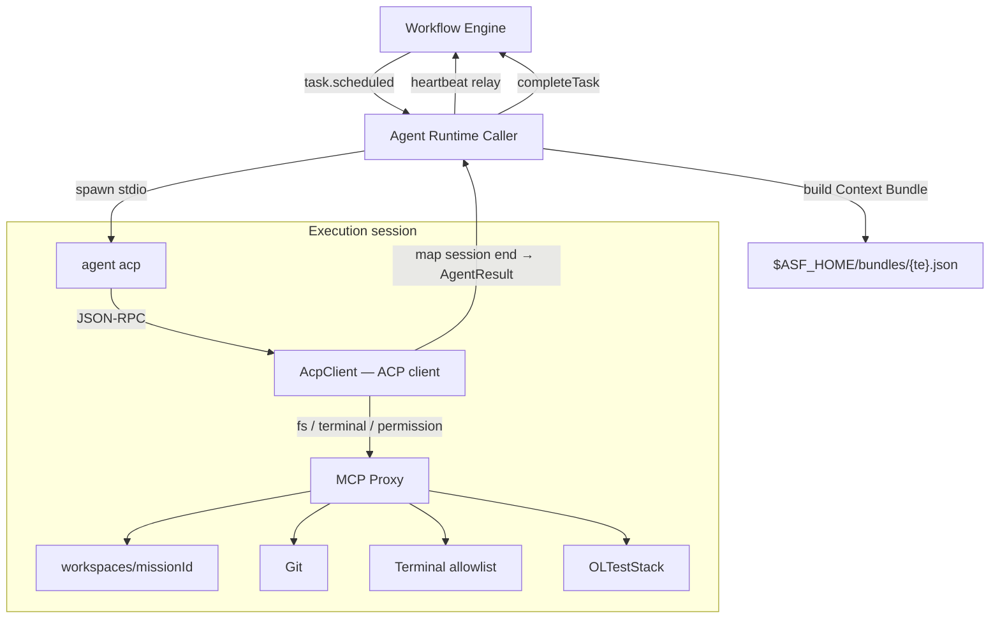

# ADR-003: Cursor via Agent Client Protocol as Primary Agent Backend

**Status:** Accepted  
**Date:** 2026-06-24  
**Deciders:** ASF architecture pivot (Cursor-only operator, autonomous factory)  
**Supersedes:** M3 custom LLM loop as v1 production path (retained as fallback / CI only)  
**Related:** [ADR-002](./ADR-002-cli-agent-runtime.md) (CLI subprocess model unchanged at engine boundary)

---

## Context

M0–M4 delivered the workflow engine, `asf-cli`, Agent Runtime Caller, MCP proxy, and a **custom LLM pilot** (`backend-engineer` via `asf agent run` + Anthropic/OpenAI adapter). That pilot proves the orchestration loop — Context Bundle → heartbeat → `completeTask` — but it is **not** how the operator runs agents day-to-day.

The operator has **Cursor only**. Autonomous execution must drive the same agent surface the operator uses: **Cursor Agent CLI** in ACP mode (`agent acp`), speaking the public [**Agent Client Protocol**](https://agentclientprotocol.com) (JSON-RPC over stdio). ASF acts as the **ACP client**; Cursor is the **ACP agent** (the side that runs the model and requests tools).

### Naming disambiguation (required)

Internal docs historically used **"ACP"** for **Agent Context Protocol session** — an isolated per-task execution environment (process sandbox, MCP proxy, workspace jail). That concept is renamed to **execution session** in this ADR and downstream requirements.

| Term | Meaning |
|------|---------|
| **Execution session** | ASF-internal: one OS subprocess + MCP proxy scope per `TaskExecution` attempt (formerly "ACP session") |
| **Agent Client Protocol (ACP)** | External standard: JSON-RPC between an ACP *client* (ASF) and an ACP *agent* (Cursor `agent acp`) |
| **`acpSessionId` field** | Legacy telemetry field on `TaskExecution`; maps to **execution session ID** — rename in schema follow-on, not blocked on v1 |

Do not conflate execution-session isolation (FR-08, process-sandbox) with the wire protocol (ASF-FW-ACP).

---

## Decision

**v1 production agent backend = Cursor CLI `agent acp` spawned as a subprocess by the Agent Runtime Caller.**

| Role | Component |
|------|-----------|
| **ACP client** | `packages/acp-client` — implements ACP client side: `initialize`, `session/new`, `session/prompt`, handles `fs/*`, `terminal/*`, `permission/*` from Cursor |
| **ACP agent** | `agent acp` on `PATH` — Cursor's stdio JSON-RPC server |
| **Tool backend** | Existing `packages/mcp-proxy` — ACP client forwards agent tool requests to MCP adapters (filesystem jail, git denylist, terminal allowlist) |
| **Orchestration** | Unchanged — Workflow Engine → Agent Runtime Caller → spawn → `completeTask` / heartbeat |



### Spawn contract (target)

```bash
# Invoked by Agent Runtime Caller — not by operators for routine use
agent acp \
  --workspace "$ASF_WORKSPACES_ROOT/$missionId" \
  # stdio JSON-RPC; no HTTP listener in v1
```

Caller responsibilities before spawn:

1. Write Context Bundle (FR-19) with task prompt, acceptance criteria, artifact paths.
2. Start MCP Proxy session bound to `taskExecutionId` and workspace jail.
3. Spawn `agent acp` with sanitized env (`CURSOR_API_KEY` from operator config; **no** `ASF_INTERNAL_JWT_SECRET` in child).
4. Run `AcpClient` on the child's stdio: `initialize` → `session/new` → `session/prompt` (bundle-derived user message).
5. Relay heartbeats to engine while session is `ACTIVE` (caller-owned; Cursor does not POST heartbeat directly).
6. On ACP session completion, map result to `AgentResult` and `POST completeTask`.

### Autonomous permission policy

Cursor's ACP agent may request permission for sensitive operations (`permission/request` or equivalent). For unattended factory runs, ASF **auto-approves** within MCP allowlists; **auto-denies** outside them.

| Request class | Policy | Enforcement layer |
|---------------|--------|-------------------|
| Filesystem read/write under workspace | **Auto-approve** | MCP path jail (reject escape before approve) |
| Git operations on allowlist (`status`, `commit`, `checkout`, …) | **Auto-approve** | MCP git denylist |
| Git denied ops (`push`, `merge`, `rebase`) | **Auto-deny** | MCP + ACP client deny response |
| Terminal `exec` with allowlisted `argv[0]` | **Auto-approve** | Terminal MCP prefix check |
| Terminal non-allowlisted or shell interpolation | **Auto-deny** | Terminal MCP |
| Browser / deploy / vault tools | **Auto-approve** if agent type allowlist includes tool | MCP + contract registry |
| Paths outside workspace, unknown tools, prod deploy without token | **Auto-deny** | MCP proxy + deploy gate |

Operator MAY set `ASF_ACP_PERMISSION_MODE=strict` to deny-all and pause mission (post-v1 interactive approval UI).

Policy source of truth: [process-sandbox.md](../requirements/framework/process-sandbox.md), [agent-contracts.md](./agent-contracts.md), [acp-cursor-integration.md](../requirements/framework/acp-cursor-integration.md).

### Fate of M3 custom LLM pilot

| Mode | When | Mechanism |
|------|------|-----------|
| **Production (default)** | Operator Mac with Cursor | `agent acp` via `AcpClient` |
| **CI / no secrets** | `ASF_USE_STUB_AGENTS=1` | In-process `StubAgentRuntime` (unchanged) |
| **Fallback / dev** | `ASF_AGENT_BACKEND=custom-llm` or missing `agent` on PATH | Existing `asf agent run` LLM loop (M3) |
| **Dry-run** | Integration tests | `asf agent run --dry-run` bundle validation only |

The custom LLM loop is **deprecated for v1 production** but **not deleted** — it remains valuable for CI without `CURSOR_API_KEY`, contract tests, and offline development. New agent capabilities SHOULD target Cursor ACP first.

---

## Consequences

### Positive

- **Same agent the operator uses** — no parallel prompt/tool stack to maintain.
- **Model routing stays in Cursor** — ASF does not manage per-type LLM API keys beyond `CURSOR_API_KEY`.
- **Engine contracts unchanged** — `completeTask`, `heartbeat`, `TaskExecution` leases identical to ADR-002.
- **MCP proxy investment preserved** — ACP client is a thin adapter, not a second tool surface.

### Negative

- **Cursor CLI dependency** — headless CI without Cursor requires stub or custom-llm fallback.
- **ACP protocol churn** — must track [agentclientprotocol.com](https://agentclientprotocol.com) and Cursor CLI releases.
- **Permission semantics** — auto-approve must be conservative; misconfigured allowlists could approve unsafe ops.

### Neutral

- `acpSessionId` telemetry field retained until schema migration; semantically **execution session ID**.
- ADR-002 subprocess model still applies — only the child binary changes from `asf agent run` (LLM) to `agent acp` (ACP).

---

## Alternatives Considered

| Alternative | Why Rejected for v1 |
|-------------|---------------------|
| **Custom LLM loop only (M3 pilot)** | Operator has Cursor only; duplicates tooling Cursor already provides; high maintenance for multi-provider tool loops |
| **Deno jail-only (`asf agent run` without Cursor)** | No autonomous coding agent without bringing your own LLM; does not match operator workflow |
| **IDE automation (AppleScript, GUI driving)** | Fragile, non-headless, breaks on UI updates; unacceptable for factory reliability |
| **Claude Code ACP (future)** | Valid follow-on if operator adds Claude; v1 optimizes for stated Cursor-only constraint |
| **In-process Cursor SDK (if any)** | No stable public embed API; subprocess + stdio matches ACP standard and ADR-002 |

---

## Dependencies

| Dependency | Required | Notes |
|------------|----------|-------|
| **`agent` on PATH** | Yes (production) | Cursor Agent CLI; `agent acp` subcommand |
| **`CURSOR_API_KEY`** | Yes (production) | Operator-provided; never in Context Bundle or workspace files |
| **`packages/mcp-proxy`** | Yes | Already shipped M4 |
| **`packages/acp-client`** | Yes (new) | ACP JSON-RPC client + permission policy |
| **Bun / `asf server start`** | Yes | Unchanged control plane |

Optional: `ASF_AGENT_BACKEND=custom-llm` retains M3 path without Cursor.

---

## References

- [Agent Client Protocol](https://agentclientprotocol.com)
- [Cursor CLI ACP docs](https://cursor.com/docs/cli/acp)
- [ADR-002 — CLI Agent Runtime](./ADR-002-cli-agent-runtime.md)
- [agent-runtime.md](./agent-runtime.md)
- [ASF-FW-ACP — acp-cursor-integration.md](../requirements/framework/acp-cursor-integration.md)
- [FR-08 — execution session](../requirements/functional/FR-08-acp-integration.md)
- [plans/v1-implementation-plan.md](./plans/v1-implementation-plan.md) — M5a–M5c
- [plans/cursor-acp-milestones.md](./plans/cursor-acp-milestones.md) — sprint breakdown
