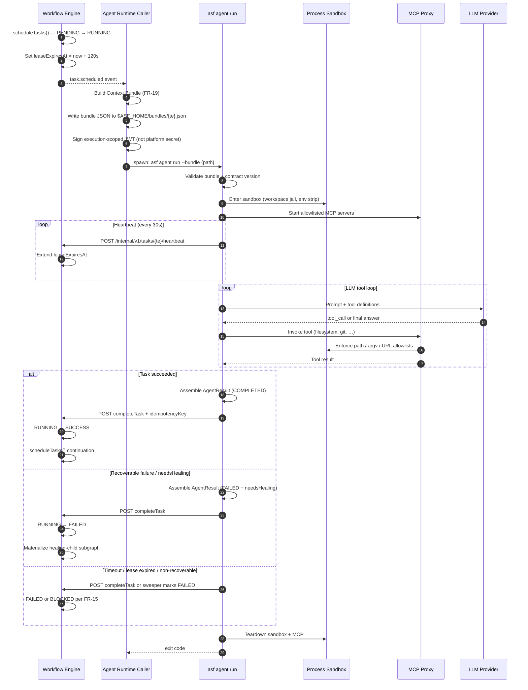
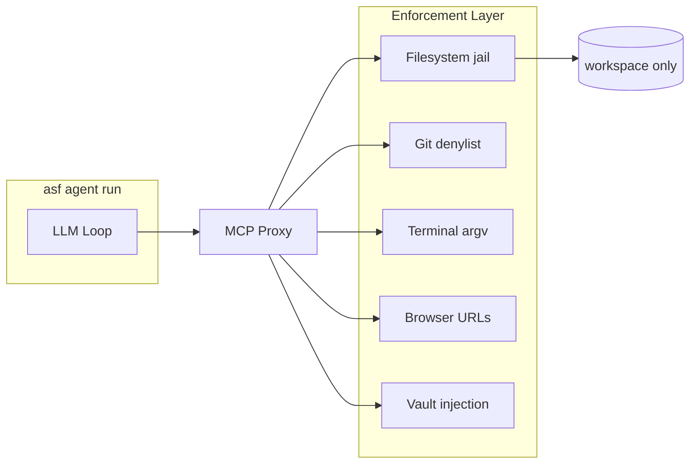
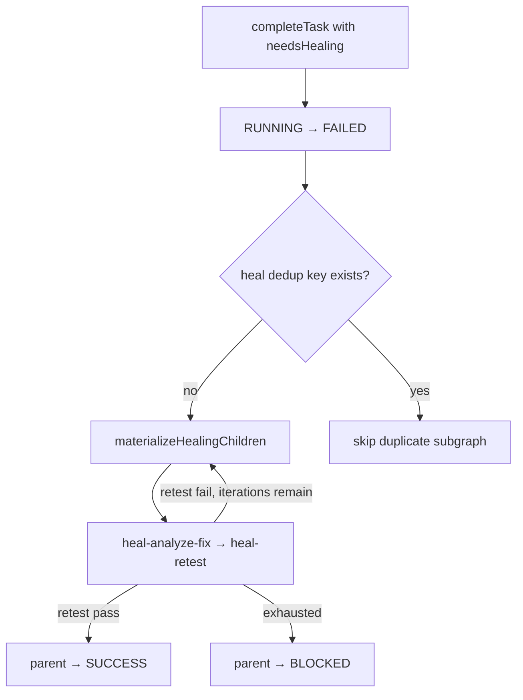

# ASF Agent Runtime

**Version:** 1.0.0  
**Status:** Engineering-ready  
**Date:** 2026-06-22  
**Entrypoint:** `asf agent run` (spawned by Agent Runtime caller)

Technical specification for how the Workflow Engine schedules work, how agent processes execute tasks, and how outcomes return to the engine. Complements the operator-facing [cli-reference.md](./cli-reference.md) and per-type rules in [agent-contracts.md](./agent-contracts.md).

---

## 1. Components

| Component | Responsibility |
|-----------|----------------|
| **Workflow Engine** | Sole `TaskExecution` state writer; schedules tasks; issues leases |
| **Agent Runtime Caller** | Subscribes to `task.scheduled`; writes Context Bundle; spawns `asf agent run` |
| **`asf agent run`** | Loads bundle; enforces sandbox; runs LLM + MCP loop; calls `completeTask` |
| **MCP Proxy** | Session-scoped tool routing; contract allowlists; vault injection |
| **Lease Sweeper** | Marks orphaned `RUNNING` executions `FAILED` on lease expiry |

In v1, the Agent Runtime Caller is co-located on the operator Mac — typically an in-process module inside `asf server start` ([ADR-001](./ADR-001-local-first-topology.md)). Phase 2 may split it onto a remote agent host with optional container isolation ([ADR-002](./ADR-002-cli-agent-runtime.md)).

---

## 2. End-to-End Sequence



---

## 3. Scheduling → Spawn

When `scheduleTasks` promotes a task `PENDING → RUNNING` (workflow-dsl §5.2):

1. Engine assigns `agentId`, sets `leaseExpiresAt = now + 120s` (configurable).
2. Emits `task.scheduled` with `{ taskId, taskExecutionId, agentType, attempt }`.
3. Agent Runtime Caller receives the event (in-process bus locally; queue in production).

**Caller responsibilities before spawn:**

| Step | Action |
|------|--------|
| 1 | Resolve agent contract from `mission.contractVersions[agentType]` |
| 2 | Build `AgentContext` via FR-19 retrieval (artifacts, memory, prior failures) |
| 3 | Verify `inputs.requiredArtifacts` exist in workspace |
| 4 | Write Context Bundle to `$ASF_HOME/bundles/{taskExecutionId}.json` |
| 5 | Mint execution JWT: `sub: agent-runtime`, claims `{ taskExecutionId, agentId }`, TTL ≤ `timeout_ms` |
| 6 | `spawn("asf", ["agent", "run", "--bundle", path], { env: sanitized })` |
| 7 | Emit `task.started` with `acpSessionId` (= process session id locally) |

**Concurrency:** Caller MUST respect engine scheduling — it does not pick tasks independently. Multiple `asf agent run` processes MAY run concurrently up to per-type `max_concurrent` limits enforced by the engine.

**Gate nodes:** `kind: gate` tasks are NOT spawned as agents; the engine runs `gate-runner` in-process (merge, test, deploy checks).

---

## 4. Context Bundle Load

`asf agent run` performs these steps before any LLM call:

```typescript
// Pseudocode — implementation target
async function loadBundle(path: string): Bundle {
  const raw = await Bun.file(path).json();
  assertSchema(raw, contextBundleV1Schema);
  const contract = contractRegistry.get(raw.agentType, raw.contractVersion);
  await verifyRequiredArtifacts(raw.context, contract.inputs.requiredArtifacts);
  await verifyWorkspace(raw.context.workspace); // exists, under ASF_WORKSPACES_ROOT
  return { ...raw, contract };
}
```

| Validation | On failure |
|------------|------------|
| Unknown `agentType` / version mismatch | Exit `1`, no `completeTask` |
| Missing required artifact | `FAILED` + `recoverable: false`, `code: MISSING_ARTIFACT` |
| Workspace outside allowed root | Exit `1` (sandbox refusal) |
| Expired execution JWT | Exit `4` |

The bundle file is deleted after terminal exit (success or failure) unless `ASF_KEEP_BUNDLES=1` (debug).

---

## 5. Process Sandbox Enforcement

v1 uses a **process-per-session** sandbox ([process-sandbox.md](../requirements/framework/process-sandbox.md), FR-08). Phase 2 may add **container-per-session** for untrusted missions — same policy gates, stronger isolation.

### 5.1 Enforcement point map

| # | Point | v1 (process sandbox) | Phase 2 (container) |
|---|-------|----------------------|------------------------|
| E1 | **Spawn** | `chdir(workspace)`; `ASF_WORKSPACES_ROOT` path validation | Dedicated container; workspace volume mount only |
| E2 | **Environment** | Clear `ASF_INTERNAL_JWT_SECRET`, `ASF_LLM_API_KEY` from child after parent reads; pass execution token only | Strip host env; inject task-scoped non-secrets only |
| E3 | **Filesystem MCP** | MCP Proxy resolves paths relative to `context.workspace`; reject `..` and symlinks escaping root | Mount `workspaces/{missionId}` read/write at `/workspace` |
| E4 | **Git MCP** | Deny `merge`, `push`, `rebase` (agent-contracts §1.3) | Same denylist at proxy |
| E5 | **Terminal MCP** | Prefix allowlist on `argv[0]`; no shell interpolation | Same; log full argv |
| E6 | **Browser MCP** | URL allowlist (deploy URLs, localhost, FR-17 hosts) | Same via OLTestStack proxy |
| E7 | **Web MCP** | HTTPS doc hosts only; no RFC1918 | Same |
| E8 | **Vault** | `vault.get(ref, sessionId)` at tool boundary | Local vault stub or file-based dev vault |
| E9 | **Network egress** | Allowlist per ADD §10.3 | Optional: deny by default in strict mode |
| E10 | **Internal API** | Container has execution JWT only | `completeTask` / `heartbeat` require execution token |
| E11 | **Teardown** | Container stop ≤ 60s | Kill MCP child processes; remove temp dirs |



**Policy source of truth:** [agent-contracts.md](./agent-contracts.md) per-type `tools.allowlist` / `denylist` + global policies §1.2.

---

## 6. LLM Loop

After sandbox entry and MCP startup:

1. Load system prompt from contract template for `agentType@version`.
2. Inject `AgentContext` (mission goal, task, acceptance criteria, artifact summaries).
3. Register MCP tools filtered by allowlist.
4. Loop until:
   - Agent calls internal `completeTask` tool (runtime-assembled `AgentResult`), or
   - Model returns structured completion JSON matching `AgentResult` schema, or
   - `timeout_ms` exceeded, or
   - Unrecoverable MCP policy violation.

| Agent type | Typical stop condition |
|------------|------------------------|
| `planner` | `tasks/plan.json` written + summary |
| `backend-engineer` | Tests pass locally + commits on `task/{taskId}` |
| `testing` | `artifacts/test-results/{taskId}.json` produced |
| `verification` | `artifacts/verification/{missionId}.json` with `status: verified` |

**Internal `completeTask` tool:** Agents MUST NOT call engine HTTP directly from the LLM. The runtime exposes a synthetic tool that validates and buffers the final `AgentResult`; the main process POSTs after sandbox teardown of writable handles.

Token usage and `durationMs` are recorded in `result.metrics` per agent-contracts §1.1.

---

## 7. Heartbeat Loop

Per agent-contracts global policy §1.2: **MUST heartbeat every 30s while `RUNNING`.**

```typescript
// Runs in parallel with LLM loop (AbortController on shutdown)
const HEARTBEAT_INTERVAL_MS = 30_000;
const EXTEND_BY_SECONDS = 120;

async function heartbeatLoop(taskExecutionId: string, token: string) {
  while (!aborted) {
    await sleep(HEARTBEAT_INTERVAL_MS);
    const res = await fetch(`${engineUrl}/internal/v1/tasks/${taskExecutionId}/heartbeat`, {
      method: "POST",
      headers: { Authorization: `Bearer ${token}`, "Content-Type": "application/json" },
      body: JSON.stringify({ extendBySeconds: EXTEND_BY_SECONDS }),
    });
    if (res.status === 404 || res.status === 409) {
      // LEASE_EXPIRED or execution no longer RUNNING — abort agent
      abort("LEASE_LOST");
    }
  }
}
```

| Parameter | Value | Notes |
|-----------|-------|-------|
| Agent heartbeat interval | 30s | Contract policy |
| Lease extension | 120s | Matches engine `LEASE_SECONDS` default |
| Sweeper period | 60s | Engine checks `leaseExpiresAt < now` |

**Lease vs wall-clock timeout** (ADD §12.1):

- Heartbeat extends the **execution lease** (crash/orphan detection).
- `timeout_ms` from agent contract is a separate **wall-clock cap**; exceeding it terminates the session even if heartbeats succeed.

---

## 8. Completion → Engine

Successful path:

```
POST /internal/v1/tasks/:taskExecutionId/complete
Authorization: Bearer <execution-token>
{
  "idempotencyKey": "complete:te-uuid:sha256(result)",
  "agentId": "a-uuid",
  "result": <AgentResult>
}
```

Engine actions (workflow-dsl §5.2):

1. Validate `AgentResult` against schema.
2. Reject if execution not `RUNNING` (`INVALID_TRANSITION` / `LEASE_EXPIRED`).
3. Transition state; emit `task.completed` | `task.failed` | `task.blocked`.
4. Call `scheduleTasks` for continuation (FR-20).
5. Return `continuation.scheduledTasks` to caller.

Agent process exits `0` after successful POST. Idempotent retry of the same `idempotencyKey` returns `duplicate: true` — agent SHOULD treat as success.

---

## 9. Failure Paths

### 9.1 `needsHealing` / recoverable failure

**Trigger:** `AgentResult` with `needsHealing: true` OR `status: FAILED` + `error.recoverable: true`.



Engine persists `failure.detected` for audit only — does not spawn a second heal on that event alone.

**Agent responsibility:** Write `artifacts/failure-reports/{taskId}.json` when applicable (FR-13). Include `classification` for fix agent routing.

### 9.2 Wall-clock timeout

| Stage | Behavior |
|-------|----------|
| T + `timeout_ms` | Agent runtime sends SIGTERM to LLM/MCP children |
| Grace 10s | Then SIGKILL |
| `completeTask` | `FAILED`, `error.code: AGENT_TIMEOUT`, `recoverable: true` (unless contract says otherwise) |
| Engine | Standard recoverable failure path if retries remain |

### 9.3 Lease expiry (orphan / crash)

| Stage | Behavior |
|-------|----------|
| No heartbeat before `leaseExpiresAt` | Sweeper transitions `RUNNING → FAILED` |
| `classification` | `timeout` |
| `recoverable` | `true` per FR-15 |
| Agent process still running | Next heartbeat returns `404`/`LEASE_EXPIRED`; agent aborts without double-complete |
| Orchestrator restart | All `RUNNING` without valid lease → `FAILED`; emit `orchestrator.recovered` |

Agent MUST NOT call `completeTask` after lease loss — engine rejects with `LEASE_EXPIRED` / `INVALID_TRANSITION`.

### 9.4 Non-recoverable failure

Examples: policy violation, missing artifact, ambiguous requirements with no path forward.

```
AgentResult: { status: FAILED, error: { recoverable: false, code: "POLICY_VIOLATION" } }
Engine: RUNNING → BLOCKED
Mission: BLOCKED if on critical path
```

### 9.5 MCP policy violation mid-loop

| Violation | Agent action | Result |
|-----------|--------------|--------|
| Path traversal | Abort tool; log | `FAILED`, `recoverable: false`, `code: SANDBOX_VIOLATION` |
| Denied git command | Abort tool | May retry if model adjusts; repeated → `FAILED` |
| Browser URL blocked | `URL_NOT_ALLOWLISTED` to model | Model must use allowed URLs |
| Terminal not allowlisted | Reject exec | Same |

### 9.6 Failure path summary

| Condition | TaskExecution | Agent exit | Healing |
|-----------|---------------|------------|---------|
| `COMPLETED` | `SUCCESS` | 0 | — |
| `needsHealing` / recoverable | `FAILED` | 3 | Yes (if iterations remain) |
| Retries exhausted | `BLOCKED` | 3 | No |
| `recoverable: false` | `BLOCKED` | 3 | No |
| `timeout_ms` | `FAILED` (recoverable) | 3 | Per FR-15 |
| Lease expired | `FAILED` (recoverable) | 4 | Per FR-15 |
| Engine down at complete | — | 2 | Caller may retry complete |

---

## 10. Agent Runtime Caller Contract

The engine expects a **CLI agent runtime caller** — a component that bridges `task.scheduled` events to `asf agent run` subprocesses.

```typescript
interface AgentRuntimeCaller {
  onTaskScheduled(event: TaskScheduledEvent): Promise<void>;
  onOrchestratorRecovery(): Promise<void>; // reap zombie processes
}
```

**Local spike (`packages/workflow-engine`):** Today uses `StubAgentRuntime` in-process for CRM simulation. Target state: replace stub invocation in the simulation loop with caller → `asf agent run`, or keep stub behind `ASF_USE_STUB_AGENTS=1` for CI without LLM.

**Phase 2 (hosted orchestrator):** Cloudflare Worker posts schedule events via internal queue; Agent Runtime Caller remains on operator or remote agent host ([ADR-001](./ADR-001-local-first-topology.md)).

---

## 11. Observability

| Signal | Destination |
|--------|-------------|
| Structured agent logs | `$ASF_AGENT_LOG_DIR/{taskExecutionId}.jsonl` |
| MCP audit trail | MCP Proxy → audit log |
| `task.started` / `task.completed` | `workflow_events` table |
| Token metrics | `AgentResult.metrics` + `Agent` row |
| Process exit code | Caller correlates with `agentId` |

---

## 12. Local vs Production Matrix

| Concern | Local (`asf server start`) | Production |
|---------|---------------------------|------------|
| Isolation | Process sandbox (§5) | Container-per-session |
| Engine | Bun HTTP, SQLite | Worker + D1 |
| Caller | In-process module | Docker `agent-runtime` service |
| LLM egress | Host network | Container allowlist |
| Browser | Local OLTestStack | OLTestStack sidecar |

---

## Related Documents

- [cli-reference.md](./cli-reference.md) — command tree, env vars, example flows
- [agent-contracts.md](./agent-contracts.md) — per-type contracts and policies
- [workflow-dsl.md](./workflow-dsl.md) — state machine, `completeTask`, `heartbeat`
- [ADD.md](./ADD.md) — §10 Security, §12 Crash Recovery
- [requirements/functional/FR-07-agent-execution.md](../requirements/functional/FR-07-agent-execution.md)
- [requirements/functional/FR-08-acp-integration.md](../requirements/functional/FR-08-acp-integration.md)
- [requirements/framework/security.md](../requirements/framework/security.md)
