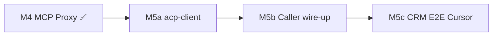

# Cursor ACP Milestones (M5a–M5c)

**Version:** 1.0.0  
**Status:** Approved for implementation  
**Date:** 2026-06-24  
**Parent plan:** [v1-implementation-plan.md](./v1-implementation-plan.md)  
**Decision:** [ADR-003](../ADR-003-cursor-acp-primary-backend.md)

Detailed sprint breakdown for the post-M4 pivot to Cursor `agent acp` as the production agent backend. M0–M4 are complete; this track replaces the original M5 "custom LLM CRM E2E" agent path.

---

## Milestone map



| ID | Theme | Duration (est.) | Exit gate |
|----|-------|-----------------|-----------|
| **M5a** | `packages/acp-client` | 5–7 days | JSON-RPC lifecycle + MCP bridge green in tests |
| **M5b** | Caller → `agent acp` | 4–6 days | Live `backend-engineer` task via Cursor on operator Mac |
| **M5c** | CRM E2E + expansion | 10–14 days | Reference CRM `SUCCESS` with Cursor on pilot + stub/CI paths |

---

## M5a — `packages/acp-client`

**Objective:** ACP client library implementing fs/terminal/permission → MCP proxy delegation.

| Task | Files | Notes |
|------|-------|-------|
| M5a.1 Scaffold package | `packages/acp-client/package.json`, `src/index.ts` | Export `AcpClient`, `SessionOutcome` |
| M5a.2 Stdio JSON-RPC transport | `src/transport.ts` | Line-delimited or length-prefixed per ACP spec |
| M5a.3 Lifecycle methods | `src/lifecycle.ts` | `initialize`, `session/new`, `session/prompt` |
| M5a.4 Filesystem handler | `src/handlers/filesystem.ts` | Map ACP fs ops → `@olagent/mcp-proxy` |
| M5a.5 Terminal handler | `src/handlers/terminal.ts` | argv allowlist via MCP |
| M5a.6 Permission policy | `src/permission.ts` | `ASF_ACP_PERMISSION_MODE`; pre-check MCP |
| M5a.7 Session outcome mapper | `src/outcome.ts` | ACP end → `AgentResult` skeleton |
| M5a.8 Recorded fixture tests | `tests/acp-fixture.test.ts` | VCR JSON-RPC without live Cursor |
| M5a.9 Live smoke script | `scripts/acp-smoke.ts` | Manual: `agent acp` + hello prompt |

**Verification:**

```bash
bun test packages/acp-client
# Recorded: initialize → session/new → session/prompt → mock fs write
# Live (operator): CURSOR_API_KEY=... bun run packages/acp-client/scripts/acp-smoke.ts
```

---

## M5b — Wire caller to `agent acp`

**Objective:** Agent Runtime Caller spawns Cursor for live agent types; retain stub and custom-llm fallback.

| Task | Files | Notes |
|------|-------|-------|
| M5b.1 Backend resolver | `agent-runtime/src/backend.ts` | `cursor-acp` \| `custom-llm` \| stub |
| M5b.2 Spawn `agent acp` | `agent-runtime/src/spawn-acp.ts` | stdio pipes, workspace cwd |
| M5b.3 Integrate AcpClient | `agent-runtime/src/caller.ts` | Replace LLM spawn for `ASF_LLM_AGENT_TYPES` |
| M5b.4 Heartbeat during ACP | `caller.ts` | Reuse M3 heartbeat loop in caller thread |
| M5b.5 completeTask wiring | `caller.ts` | Outcome → engine POST |
| M5b.6 Env documentation | `docs/cli-reference.md` | `CURSOR_API_KEY`, `ASF_AGENT_BACKEND` |
| M5b.7 Deprecation notice | `agent-runtime/src/llm/*` | Comment: CI/fallback only |
| M5b.8 Integration test | `agent-runtime/tests/acp-caller.test.ts` | Mock `agent` binary |

**Verification:**

```bash
export CURSOR_API_KEY=...
export ASF_AGENT_BACKEND=cursor-acp
export ASF_LLM_AGENT_TYPES=backend-engineer
asf server start
asf mission create --file requirements/fixtures/local-operator-mission.yaml
asf mission start m-crm-local
# Observe agent acp child; task t-contacts-api reaches SUCCESS
```

---

## M5c — CRM E2E with Cursor

**Objective:** Full reference CRM mission to `SUCCESS`; expand Cursor-backed agent types incrementally.

| Task | Files | Notes |
|------|-------|-------|
| M5c.1 Pilot gating | `caller.ts` | `ASF_CURSOR_AGENT_TYPES=backend-engineer` (rename from LLM env) |
| M5c.2 Gate merge automation | `gates/merge.ts` | Unchanged from original M5 |
| M5c.3 Expand agent types | config | backend → frontend → testing (one at a time) |
| M5c.4 Deploy + verify | vault + browser MCP | Staging deploy via vault |
| M5c.5 Healing path | `tests/crm-healing-e2e.test.ts` | Stub agents OK for heal subgraph in CI |
| M5c.6 CI profile | `.github/` or docs | `ASF_USE_STUB_AGENTS=1` unchanged |
| M5c.7 Operator quickstart | `packages/workflow-engine/README.md` | Cursor-specific setup |
| M5c.8 Doc re-review | `docs/reviews/` | Post-M5c five-lens pass |

**Verification:**

```bash
export CURSOR_API_KEY=...
export ASF_HOME=$PWD/.asf-local
asf server start
asf mission create --file requirements/fixtures/local-operator-mission.yaml
asf mission start m-crm-local
asf mission watch m-crm-local --interval 5
# Exit 0; artifacts/verification/m-crm-local.json status: verified
```

**CI (no Cursor):**

```bash
export ASF_USE_STUB_AGENTS=1
bun test packages/
```

---

## Recommended sprint (1–2 weeks) — M5a + M5b start

**Sprint goal:** `backend-engineer` completes one real task via `agent acp` on operator Mac; CI remains green with stubs.

### Week 1

| Day | Deliverable |
|-----|-------------|
| 1–2 | M5a.1–M5a.3: Package scaffold, transport, lifecycle |
| 3–4 | M5a.4–M5a.6: fs/terminal/permission handlers + policy |
| 5 | M5a.8: Recorded fixture tests green |

### Week 2

| Day | Deliverable |
|-----|-------------|
| 1–2 | M5b.1–M5b.3: Backend resolver + spawn + caller integration |
| 3 | M5b.4–M5b.5: Heartbeat + completeTask |
| 4–5 | M5b.8 + live smoke: single backend task SUCCESS on CRM mission |

**Sprint exit demo:**

```bash
export CURSOR_API_KEY=...
export ASF_AGENT_BACKEND=cursor-acp
export ASF_CURSOR_AGENT_TYPES=backend-engineer
asf server start &
asf mission create --file requirements/fixtures/local-operator-mission.yaml
asf mission start m-crm-local
asf mission watch m-crm-local --interval 3
# implement-backend SUCCESS via Cursor; other tasks stub if not in ASF_CURSOR_AGENT_TYPES
```

**Next sprint:** M5c full CRM E2E + agent type expansion.

---

## Risks

| Risk | Mitigation |
|------|------------|
| ACP schema drift vs Cursor releases | Version negotiate in `initialize`; pin CLI in docs |
| No Cursor in CI | Stubs + recorded JSON-RPC fixtures |
| Permission over-approval | MCP pre-check before approve; audit log |
| Long CRM wall-clock + API cost | `ASF_CURSOR_AGENT_TYPES` gating; stub majority in dev |

---

## Related

- [ADR-003](../ADR-003-cursor-acp-primary-backend.md)
- [ASF-FW-ACP](../../requirements/framework/acp-cursor-integration.md)
- [v1-implementation-plan.md](./v1-implementation-plan.md)
