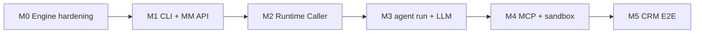
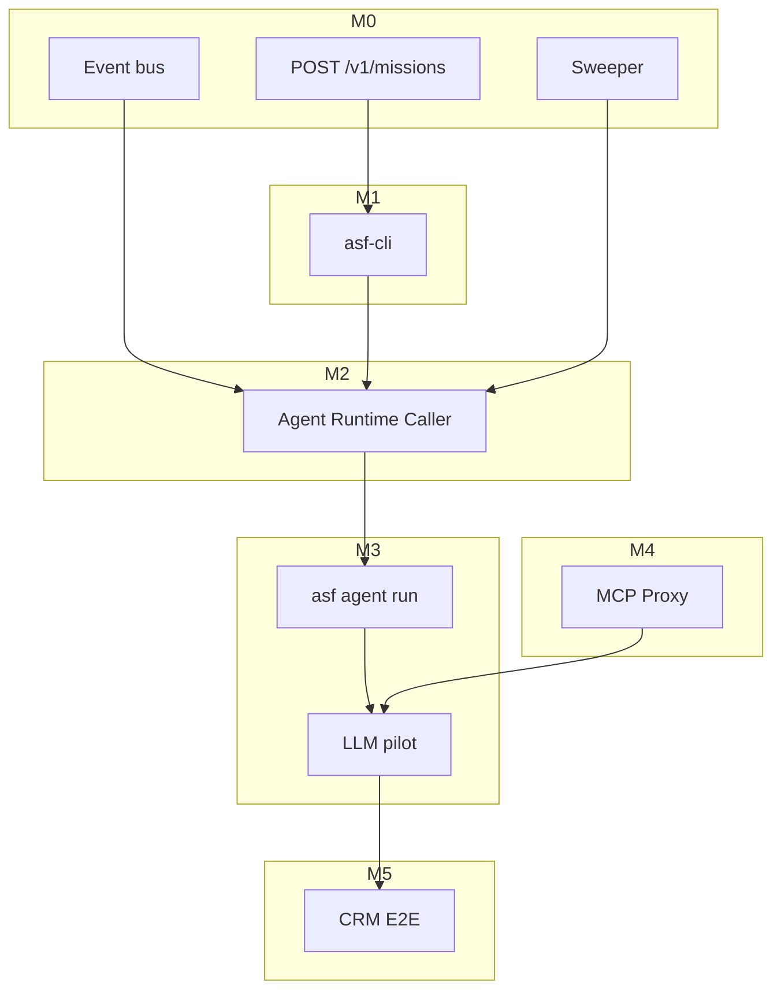

# ASF v1 Implementation Plan

**Version:** 1.0.0  
**Status:** Approved for kickoff  
**Date:** 2026-06-22  
**Scope:** Local-first, CLI-first Autonomous Software Factory on operator Mac

This plan turns the engineering contracts in `docs/` into shippable v1 software. Architecture is **fixed** per [ADR-001](../ADR-001-local-first-topology.md) and [ADR-002](../ADR-002-cli-agent-runtime.md) — do not re-litigate topology or agent isolation model here.

---

## 1. Goal & Success Criteria

### 1.1 North-star goal

An operator on macOS can run the full ASF control plane locally, create the reference CRM mission from a fixture file, start autonomous execution, and watch the mission reach `SUCCESS` — with **at least one agent type** executing via real LLM + MCP (not stub).

### 1.2 v1 success criteria

| # | Criterion | Verification |
|---|-----------|--------------|
| SC-1 | `asf server start` serves Mission Manager + Workflow Engine on `127.0.0.1:3100` with SQLite persistence | `curl GET /v1/missions/:id` after create |
| SC-2 | `asf mission create --file requirements/fixtures/local-operator-mission.yaml` provisions workspace + seed DAG | Workspace tree + `mission.created` event |
| SC-3 | `asf mission start` + `asf mission watch` drive FR-20 continuation without manual per-task commands | Mission reaches terminal state unattended |
| SC-4 | Agent Runtime Caller spawns `asf agent run` on `task.scheduled` (stub behind `ASF_USE_STUB_AGENTS=1`) | Integration test + log correlation |
| SC-5 | **One agent type** (recommended: `backend-engineer`) completes a real task via LLM + filesystem MCP | `AgentResult` with real commits/artifacts |
| SC-6 | CRM reference path reaches `SUCCESS` against [reference-crm-mission.md](../../requirements/fixtures/reference-crm-mission.md) oracle | FR-17 checks in `artifacts/verification/{missionId}.json` |
| SC-7 | `bun test packages/*` green; CRM simulation green without LLM (`ASF_USE_STUB_AGENTS=1`) | CI gate |

### 1.3 Explicit non-goals (v1)

- Hosted Cloudflare orchestrator (Phase 2)
- Docker/container agent isolation
- Mission Dashboard UI (CLI-only operator surface)
- Windows native support
- Production multi-tenant hardening
- Full autonomous CRM with **all** agent types on real LLM in v1.0 — stubs acceptable for non-pilot types until M5 expansion

### 1.4 Acceptance oracle

Primary fixture: [local-operator-mission.yaml](../../requirements/fixtures/local-operator-mission.yaml)  
Oracle spec: [reference-crm-mission.md](../../requirements/fixtures/reference-crm-mission.md)

Minimum task graph after planner merge:

```
setup-repo → schema-migration → [implement-backend ∥ implement-frontend] → gate-merge-* → write-tests → browser-test → deploy → verify-deployment
```

---

## 2. Current State (baseline)

| Asset | Status |
|-------|--------|
| JSON schemas (`requirements/schemas/`) | Published |
| Engineering docs (ADD, workflow-dsl, agent-contracts, cli-reference, agent-runtime) | P0 fixes applied |
| ADR-001, ADR-002 | Accepted |
| `packages/workflow-engine` | Spike: state machine, planner merge, healing, HTTP server, **11 tests pass** |
| `StubAgentRuntime` | In-process golden results for CRM simulation |
| `asf` CLI | **M1 done** — `packages/asf-cli` |
| Mission Manager `POST /v1/missions` | **M1 done** |
| Agent Runtime Caller | **M2 done** — subprocess `asf agent run --dry-run` |
| MCP Proxy | **Not implemented** |

### 2.1 Engine APIs already implemented

| Route | Auth | Notes |
|-------|------|-------|
| `POST /internal/v1/missions/:id/start` | JWT | ✅ |
| `POST /internal/v1/tasks/:taskExecutionId/complete` | JWT | ✅ |
| `POST /internal/v1/tasks/:taskExecutionId/heartbeat` | JWT | ✅ |
| `POST /internal/v1/schedule` | JWT | ✅ |
| `GET /v1/missions/:id` | none | ✅ |
| `GET /v1/missions/:id/events` | none | ✅ |

### 2.2 Engine APIs still required

| Route | Auth | Milestone |
|-------|------|-----------|
| `POST /v1/missions` | none (local) | M1 |
| `GET /v1/missions/:id/tasks` | none | M1 |
| `GET /v1/missions/:id/events` (SSE `--follow`) | none | M1 (polling first; SSE optional) |
| `GET /v1/missions/:id/workflow-graph` | none | M2 (defer if status suffices) |
| `POST /v1/missions/:id/pause` / `resume` | none | **Cut** — post-v1 |
| `POST /v1/missions/:id/approve-deploy` | operator JWT | M5 (staging-only v1 may skip prod gate) |
| `GET /internal/v1/missions/:id/eligible-tasks` | JWT | M0 (debug aid) |

---

## 3. Package Structure

Monorepo layout under `packages/` (Bun workspaces, root `package.json` already configured).

```
packages/
├── workflow-engine/          # EXISTS — sole TaskExecution writer, HTTP server host
├── asf-cli/                  # NEW — `asf` binary, operator commands, dev token
├── agent-runtime/            # NEW — caller, context bundle, subprocess spawn
├── mcp-proxy/                # NEW — session-scoped tool routing, allowlists
├── contracts/                # NEW — agent contract registry, prompt templates, Zod mirrors
└── shared/                   # NEW — JWT helpers, config, shared types (optional merge w/ contracts)
```

### 3.1 Package responsibilities

| Package | Exports | Depends on |
|---------|---------|------------|
| `@olagent/workflow-engine` | `WorkflowEngine`, `createWorkflowServer`, event types | `zod`, `@olagent/shared` |
| `@olagent/shared` | Config (`ASF_HOME`), JWT sign/verify, id helpers, schema re-exports | `zod` |
| `@olagent/contracts` | `contractRegistry`, per-type allowlists, system prompts | `@olagent/shared` |
| `@olagent/mcp-proxy` | `McpProxySession`, filesystem/git/terminal/browser adapters | `@olagent/contracts` |
| `@olagent/agent-runtime` | `AgentRuntimeCaller`, `buildContextBundle`, `spawnAgentRun` | `workflow-engine`, `shared`, `contracts` |
| `@olagent/asf-cli` | CLI entry (`bin/asf`), HTTP client to engine | all above |

### 3.2 Binary & server composition

`asf server start` runs **one Bun process** that:

1. Opens SQLite at `$ASF_HOME/workflow.db`
2. Mounts `createWorkflowServer()` from `workflow-engine`
3. Registers `AgentRuntimeCaller` on in-process event bus
4. Starts lease sweeper interval (60s)
5. Optionally starts MCP proxy listener (stdio bridge only — no separate port in v1)

Root `package.json` scripts (target):

```json
{
  "scripts": {
    "test": "bun test packages/",
    "typecheck": "bun run --filter '@olagent/*' typecheck",
    "asf": "bun run packages/asf-cli/src/main.ts"
  }
}
```

### 3.3 File-level placement hints

| Concern | Primary location |
|---------|------------------|
| Mission create handler | `packages/workflow-engine/src/server/handlers.ts` + `engine/engine.ts` |
| Workspace provisioning | `packages/workflow-engine/src/mission/workspace.ts` (new) |
| Event bus (`task.scheduled`) | `packages/workflow-engine/src/engine/events.ts` (new) |
| Lease sweeper | `packages/workflow-engine/src/engine/sweeper.ts` (new) |
| CLI commands | `packages/asf-cli/src/commands/{server,mission,agent,dev}.ts` |
| Context bundle builder | `packages/agent-runtime/src/bundle.ts` |
| Subprocess spawn | `packages/agent-runtime/src/spawn.ts` |
| LLM loop | `packages/asf-cli/src/agent/llm-loop.ts` or `packages/agent-runtime/src/llm-loop.ts` |
| Process sandbox | `packages/agent-runtime/src/sandbox.ts` |
| MCP filesystem jail | `packages/mcp-proxy/src/filesystem.ts` |
| Gate runners (merge, test) | `packages/workflow-engine/src/gates/` (new) |

---

## 4. Phased Milestones



### Milestone summary

| Milestone | Theme | Duration (est.) | Exit gate |
|-----------|-------|-----------------|-----------|
| **M0** | Engine hardening | 3–5 days | ✅ Done (`4d2745d`) — sweeper, event bus, `POST /v1/missions`, 15 tests |
| **M1** | CLI + Mission Manager | 5–7 days | ✅ Done (`e9c02c1`) — `packages/asf-cli`, create → start → watch SUCCESS |
| **M2** | Agent Runtime Caller | 4–6 days | ✅ Done — subprocess `asf agent run --dry-run` on `task.scheduled` |
| **M3** | `asf agent run` + LLM pilot | 7–10 days | One agent type real LLM task completes |
| **M4** | MCP Proxy + sandbox | 7–10 days | Filesystem jail + git denylist enforced |
| **M5** | CRM E2E + verification | 10–14 days | Reference CRM `SUCCESS` with mixed stub/real agents |

---

## 5. Per-Milestone Tasks

### M0 — Engine hardening (complete the spike)

**Objective:** Close gaps between the in-process simulation and the HTTP/CLI contract.

| Task | Files / APIs | Notes |
|------|--------------|-------|
| M0.1 In-process event bus | `engine/events.ts`, emit on `scheduleTasks` | `task.scheduled`, `task.completed`, etc. per workflow-dsl §6 |
| M0.2 Lease sweeper | `engine/sweeper.ts`, wire in `server/main.ts` | `RUNNING` + expired lease → `FAILED`, emit `orchestrator.recovered` on startup |
| M0.3 `POST /v1/missions` | `handlers.ts`, `engine.createMission()` extend | Validate `mission.v1.json`; seed bootstrap DAG; return projection |
| M0.4 Workspace provisioning | `mission/workspace.ts` | Atomic mkdir: `artifacts/`, `tasks/`, `.asf/`; copy mission YAML |
| M0.5 Idempotent create | `engine/store.ts` | FR-01 `idempotencyKey` on missions table |
| M0.6 `GET /v1/missions/:id/tasks` | `handlers.ts` | Task list with latest execution status |
| M0.7 Gate runner skeleton | `gates/merge.ts`, `gates/runner.ts` | In-process merge gate (no agent spawn) |
| M0.8 CRM E2E via HTTP | `tests/crm-http-e2e.test.ts` | Create mission via POST, drive via curl tokens |

**Verification:**

```bash
bun test packages/workflow-engine
export ASF_INTERNAL_JWT_SECRET=dev-secret
bun run packages/workflow-engine/src/server/main.ts &
# POST /v1/missions with local-operator-mission body → start → stub complete chain
```

---

### M1 — `asf` CLI + operator surface

**Objective:** Ship the `asf` binary per [cli-reference.md](../cli-reference.md).

| Task | Files | Notes |
|------|-------|-------|
| M1.1 Scaffold `packages/asf-cli` | `package.json`, `src/main.ts`, `src/cli.ts` | Use minimal arg parser (Bun-native or `citty`) |
| M1.2 Config resolution | `shared/src/config.ts` | `ASF_HOME`, `config.toml`, flag overrides |
| M1.3 `asf server start` | `commands/server.ts` | Wrap `createWorkflowServer` + sweeper + caller stub |
| M1.4 `asf dev token` | `commands/dev.ts` | Reuse `signInternalJwt` from shared |
| M1.5 `asf mission create` | `commands/mission/create.ts` | `POST /v1/missions` or in-process call |
| M1.6 `asf mission start` | `commands/mission/start.ts` | `POST /internal/v1/missions/:id/start` with JWT |
| M1.7 `asf mission status` | `commands/mission/status.ts` | Human + `--json` formatting |
| M1.8 `asf mission watch` | `commands/mission/watch.ts` | Poll `GET /v1/missions/:id` every N seconds |
| M1.9 `asf mission events` | `commands/mission/events.ts` | `GET /v1/missions/:id/events` |
| M1.10 CLI integration tests | `packages/asf-cli/tests/` | Spawn server on port 0, run create → start → status |

**Verification:**

```bash
export ASF_INTERNAL_JWT_SECRET=dev-secret-change-me
export ASF_HOME=$PWD/.asf-local
asf server start   # terminal 1
asf mission create --file requirements/fixtures/local-operator-mission.yaml
asf mission start m-crm-local
asf mission status m-crm-local --json
```

---

### M2 — Agent Runtime Caller

**Objective:** Bridge `task.scheduled` → Context Bundle → `asf agent run` subprocess.

| Task | Files | Notes |
|------|-------|-------|
| M2.1 Scaffold `packages/agent-runtime` | `src/caller.ts` | Implement `AgentRuntimeCaller` interface |
| M2.2 Contract resolution | `contracts/src/registry.ts` | Load from `mission.contractVersions` |
| M2.3 Context bundle builder | `agent-runtime/src/bundle.ts` | FR-19: artifacts summaries, prior failures |
| M2.4 Execution JWT minting | `agent-runtime/src/token.ts` | Claims: `{ taskExecutionId, agentId }`, scoped TTL |
| M2.5 Bundle persistence | `$ASF_HOME/bundles/{te}.json` | Per cli-reference §6.1 |
| M2.6 Subprocess spawn | `agent-runtime/src/spawn.ts` | `Bun.spawn(["asf", "agent", "run", "--bundle", path])` |
| M2.7 `ASF_USE_STUB_AGENTS=1` | `caller.ts` | Fall back to `StubAgentRuntime` for CI |
| M2.8 Zombie reap on recovery | `caller.onOrchestratorRecovery()` | Kill orphaned `asf agent run` children |
| M2.9 Wire caller into server | `workflow-engine/src/server/main.ts` | Subscribe to event bus |
| M2.10 `asf agent run --dry-run` | `asf-cli/src/commands/agent/run.ts` | Validate bundle only; exit 0/1 |

**Verification:**

```bash
ASF_USE_STUB_AGENTS=0 asf server start
asf mission create --file requirements/fixtures/local-operator-mission.yaml
asf mission start m-crm-local
# Observe child processes; bundles appear in $ASF_HOME/bundles/
asf agent run --bundle $ASF_HOME/bundles/<te>.json --dry-run
```

---

### M3 — `asf agent run` + LLM pilot (one agent type)

**Objective:** Real agent execution for **one** agent type; others remain stubbed or dry-run skipped.

**Recommended pilot:** `backend-engineer` on `implement-backend` tasks (clear artifacts, testable output).

| Task | Files | Notes |
|------|-------|-------|
| M3.1 Bundle loader + validation | `agent-runtime/src/load-bundle.ts` | Zod + contract version check |
| M3.2 Sandbox entry | `agent-runtime/src/sandbox.ts` | `chdir(workspace)`, env strip per agent-runtime §5 |
| M3.3 Heartbeat loop | `agent-runtime/src/heartbeat.ts` | 30s interval, parallel with LLM |
| M3.4 LLM provider adapter | `agent-runtime/src/llm/{anthropic,openai}.ts` | `ASF_LLM_PROVIDER`, `ASF_LLM_API_KEY` |
| M3.5 Agent prompt assembly | `contracts/prompts/backend-engineer.md` | Inject `AgentContext` |
| M3.6 Internal `completeTask` tool | `agent-runtime/src/tools/complete.ts` | Buffer `AgentResult`; POST after loop |
| M3.7 Wall-clock timeout | `agent-runtime/src/timeout.ts` | SIGTERM → SIGKILL per §9.2 |
| M3.8 Pilot gating | `caller.ts` | `ASF_LLM_AGENT_TYPES=backend-engineer` — stub others |
| M3.9 Integration test | `packages/agent-runtime/tests/backend-pilot.test.ts` | Mock LLM or recorded fixture |

**Verification:**

```bash
export ASF_LLM_API_KEY=...
export ASF_LLM_AGENT_TYPES=backend-engineer
asf server start
# Drive mission until t-contacts-api (or isolated test mission with one backend task)
# Confirm real files under workspace + completeTask SUCCESS
```

---

### M4 — MCP Proxy + process sandbox

**Objective:** Enforce tool allowlists at the MCP boundary per [process-sandbox.md](../../requirements/framework/process-sandbox.md).

| Task | Files | Notes |
|------|-------|-------|
| M4.1 Scaffold `packages/mcp-proxy` | `src/session.ts` | One session per `asf agent run` |
| M4.2 Filesystem MCP | `src/adapters/filesystem.ts` | Path jail, reject `..` and escape symlinks |
| M4.3 Git MCP | `src/adapters/git.ts` | Deny `merge`, `push`, `rebase` |
| M4.4 Terminal MCP | `src/adapters/terminal.ts` | argv[0] prefix allowlist; no shell interpolation |
| M4.5 Browser MCP | `src/adapters/browser.ts` | OLTestStack client; URL allowlist from mission constraints |
| M4.6 Web MCP | `src/adapters/web.ts` | HTTPS doc hosts only (SSRF guard) |
| M4.7 Vault stub | `src/vault.ts` | OD-1: file-based dev vault for deploy credentials |
| M4.8 MCP config | `$ASF_HOME/mcp.json` | stdio server entries per OD-9 |
| M4.9 Audit log | `src/audit.ts` | JSONL per taskExecutionId |
| M4.10 Wire proxy into agent run | `agent/run.ts` | Start MCP before LLM loop |

**Verification:**

```bash
bun test packages/mcp-proxy
# Agent attempt to read /etc/passwd → SANDBOX_VIOLATION
# git push → denied
```

---

### M5 — CRM E2E with real LLM

**Objective:** Full reference CRM mission to `SUCCESS`; expand LLM agents incrementally.

| Task | Files | Notes |
|------|-------|-------|
| M5.1 Bootstrap agents (discovery → plan) | stub or LLM per `ASF_LLM_AGENT_TYPES` | Planner must emit valid `tasks/plan.json` |
| M5.2 Gate merge automation | `gates/merge.ts` | Auto `gate-merge-*` after parallel tasks |
| M5.3 Implementation agents | expand `ASF_LLM_AGENT_TYPES` | backend → frontend → testing |
| M5.4 Deploy agent | Cloudflare API via vault | Staging URLs in deployment report |
| M5.5 Verification agent | `gates/verify.ts` + browser MCP | FR-17 oracle; smoke data cleanup |
| M5.6 Healing path test | `tests/crm-healing-e2e.test.ts` | `needsHealing` → heal subgraph → SUCCESS |
| M5.7 Operator docs | Update workflow-engine README | Full copy-paste quickstart |
| M5.8 Five-lens doc re-review | `docs/reviews/` | Trigger per docs/README |

**Verification:**

```bash
export ASF_INTERNAL_JWT_SECRET=...
export ASF_HOME=$PWD/.asf-local
export ASF_LLM_API_KEY=...
asf server start
asf mission create --file requirements/fixtures/local-operator-mission.yaml
asf mission start m-crm-local
asf mission watch m-crm-local --interval 5
# Exit 0; artifacts/verification/m-crm-local.json status: verified
```

---

## 6. Dependencies & Sequencing



| Blocker | Blocked work |
|---------|--------------|
| M0 event bus | M2 caller subscription |
| M0 `POST /v1/missions` | M1 `mission create` |
| M1 CLI JWT signing | M1 `mission start`, M2 execution tokens |
| M2 spawn wiring | M3 real `agent run` |
| M3 bundle loader | M4 MCP session bind |
| M4 filesystem MCP | M5 implementation agents writing code |
| M3 LLM pilot | M5 planner/bootstrap quality |

**Parallelizable work:**

- M0.7 gate skeleton ∥ M1 CLI scaffold (after M0.3 mission create API defined)
- M4 MCP adapters ∥ M3 LLM loop (filesystem MCP required before merge)
- `packages/contracts` prompt templates ∥ M2 bundle builder

---

## 7. Risks & Cuts

### 7.1 Risks

| Risk | Impact | Mitigation |
|------|--------|------------|
| LLM planner emits invalid `plan.json` | Blocks implementation DAG | Validate against `tasks-plan.v1.json`; stub planner in CI; human-fix loop for v1 |
| CRM E2E duration (hours) + API cost | Slow feedback | `ASF_LLM_AGENT_TYPES` gating; recorded VCR tests; stub majority |
| MCP stdio reliability (OD-9) | Flaky agent sessions | Restart MCP children; audit log; `--dry-run` |
| Cloudflare deploy credentials (OD-1) | Deploy task fails | File vault + documented `wrangler` login fallback |
| Process sandbox escape on Mac | Security incident | Path jail + deny sensitive `ASF_WORKSPACES_ROOT`; document single-operator threat model |
| Gate runner complexity | Schedule deadlocks | Keep merge gate in-engine; defer git merge queue automation |

### 7.2 Timeline slip cuts (ordered)

1. **Cut SSE** — polling only for `mission watch --follow` (OD-8)
2. **Cut pause/resume** — not in v1 CLI reference critical path
3. **Cut browser-test real LLM** — stub with golden `AgentResult` until M5 late
4. **Cut deploy to real Cloudflare** — mock deployment report JSON; manual deploy demo
5. **Cut healing E2E** — unit tests only; single-pass CRM more important
6. **Cut Web MCP** — docs-only research agent uses filesystem artifacts
7. **Cut multi-agent LLM** — ship M3 with `backend-engineer` only; CRM SUCCESS with stubs elsewhere still demonstrates orchestration

**Non-negotiable for v1 claim:** SC-1 through SC-5 and CRM orchestration to `SUCCESS` with at least one real LLM agent.

---

## 8. Verification Matrix

| Milestone | Commands | Expected |
|-----------|----------|----------|
| M0 | `bun test packages/workflow-engine` | All green; new HTTP mission test |
| M1 | `asf mission create && asf mission status` | `PENDING` → workspace exists |
| M2 | `ls $ASF_HOME/bundles/` after start | Bundle JSON per scheduled task |
| M3 | `asf agent run --bundle ...` (no dry-run) | Exit 0; engine shows SUCCESS |
| M4 | `bun test packages/mcp-proxy` | Jail + denylist tests pass |
| M5 | `asf mission watch m-crm-local` | Exit 0; verification artifact verified |

**CI profile (no secrets):**

```bash
export ASF_USE_STUB_AGENTS=1
export WORKFLOW_DB_PATH=:memory:
bun test packages/
```

---

## 9. Open Decisions

Decisions from [ADD §13](../ADD.md#13-open-decisions) plus plan-specific items. Resolve during the listed milestone.

| ID | Decision | Options | Recommendation | Resolve by | Status |
|----|----------|---------|----------------|------------|--------|
| OD-1 | Vault backend | Keychain vs encrypted file vs env | File-based dev vault (`$ASF_HOME/vault.enc`) + env override | M4 | Open |
| OD-3 | LLM model per agent type | Single model vs per-type table | Single `claude-sonnet-4-20250514` v1; table in M5 | M3 | Open |
| OD-4 | Remote git push timing | Per-task vs mission-end | Defer remote push v1; local commits only | M5 | Open |
| OD-5 | Squash on merge to main | Squash vs merge commit | Defer — branch-per-task local only | Post-v1 | Open |
| OD-8 | SSE vs polling | SSE vs poll | Poll in M1; SSE optional M5 | M1 | **Lean poll** |
| OD-9 | MCP transport | stdio vs HTTP proxy | stdio sidecars launched by agent run | M4 | Open |
| OD-11 | Pilot agent type | planner vs backend-engineer vs infra | `backend-engineer` — deterministic artifact check | M3 | **Proposed** |
| OD-12 | Stub vs LLM per type | Env allowlist vs config file | `ASF_LLM_AGENT_TYPES` comma-separated | M3 | **Proposed** |
| OD-13 | `asf` compile target | Bun interpreted vs compiled binary | `bun run` wrapper v1; `bun build --compile` post-v1 | M1 | Open |
| OD-14 | Gate test runner | In-process bun test vs spawn | In-process `bun test` in workspace for `gate-merge` | M0 | Open |
| OD-15 | CRM LLM scope for v1.0 | One type vs all types | One real + stubs acceptable for v1.0 tag | M5 | **Proposed** |

Resolved (do not reopen): OD-2 (CLI subprocess), OD-6 (no re-plan), OD-10 (flat tasks + `parentTaskId`).

---

## 10. Recommended First Sprint (1–2 weeks)

**Sprint goal:** Operator can create and start a CRM mission from the CLI against a persisted local server; engine emits `task.scheduled` events; stubs still complete tasks end-to-end.

### Week 1

| Day | Deliverable |
|-----|-------------|
| 1–2 | M0.1–M0.3: Event bus, sweeper, `POST /v1/missions` + tests |
| 3 | M0.4–M0.6: Workspace provisioning, `GET /v1/missions/:id/tasks` |
| 4–5 | M1.1–M1.5: `packages/asf-cli` + `server start` + `mission create` |

### Week 2

| Day | Deliverable |
|-----|-------------|
| 1–2 | M1.6–M1.9: `mission start`, `status`, `watch`, `dev token` |
| 3 | M0.8 + M1.10: HTTP CRM path + CLI integration test |
| 4–5 | M2.1–M2.6: Agent Runtime Caller spawning `asf agent run --dry-run` |

**Sprint exit demo:**

```bash
export ASF_INTERNAL_JWT_SECRET=dev-secret-change-me
export ASF_HOME=$PWD/.asf-local
asf server start &
asf mission create --file requirements/fixtures/local-operator-mission.yaml
asf mission start m-crm-local
asf mission watch m-crm-local --interval 3   # SUCCESS with ASF_USE_STUB_AGENTS=1
```

**Next sprint:** M3 LLM pilot (`backend-engineer`) + M4 filesystem MCP.

---

## Related Documents

- [docs/README.md](../README.md) — documentation index
- [cli-reference.md](../cli-reference.md) — command contract
- [agent-runtime.md](../agent-runtime.md) — spawn and completion sequence
- [workflow-dsl.md](../workflow-dsl.md) — state machine and APIs
- [ADD.md](../ADD.md) — component boundaries
- [packages/workflow-engine/README.md](../../packages/workflow-engine/README.md) — spike quickstart
- [requirements/framework/cli-agent-runtime.md](../../requirements/framework/cli-agent-runtime.md) — FR-level CLI requirements
