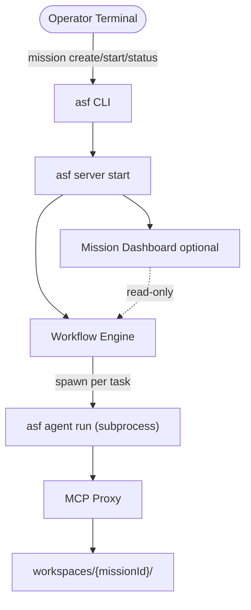

# ASF-00 — Overview

## Summary

The Autonomous Software Factory (ASF) is a **local-first**, CLI-driven agent runtime that converts a single user goal into a completed, tested, and deployable software application with minimal or no human intervention. ASF orchestrates specialized AI agents across the full SDLC — from requirements discovery through deployment verification — using durable workflows, process-isolated execution contexts, and self-healing feedback loops. Operators interact primarily through the `asf` CLI (similar to Cursor Agent or Claude Code), with an optional Mission Dashboard for observability.

## Product Vision

**Input:** A natural-language goal such as *"Build a CRM for small businesses"* or a structured mission file with constraints.

**Output:** A fully realized application with the following checklist completed autonomously:

- [ ] Requirements gathered and documented
- [ ] Architecture designed with API and data contracts
- [ ] Database schema created and migrated
- [ ] Backend and frontend implemented
- [ ] Automated tests generated and passing
- [ ] Browser-based end-to-end tests passed
- [ ] Application deployed to the target environment
- [ ] Deployment verified (reachable, APIs healthy, UI accessible, auth working)

No manual step initiation is required between mission start and mission completion unless the system enters a `BLOCKED` state awaiting human input.

## User Story

> As a product owner or founder, I want to describe what I need in plain language so that ASF researches the domain, designs the system, writes the code, tests it, deploys it, and verifies it — without me managing individual developer tasks.

## System Story

> As the ASF platform, I must accept a mission via CLI or API, decompose it into a directed workflow of tasks, spawn each task as an isolated agent subprocess (`asf agent run`), persist all artifacts under `workspaces/{missionId}/`, detect failures automatically, attempt self-healing within policy limits, and continue executing until the mission succeeds or is explicitly blocked.

## Local-First Operator Model

ASF v1 targets a **single trusted operator** running on their own machine:

1. **CLI-primary** — `asf mission create`, `asf mission start`, `asf mission status`, `asf server start` are the primary control surface ([framework/cli-agent-runtime.md](./framework/cli-agent-runtime.md)).
2. **Process isolation** — each task runs in a dedicated OS subprocess with MCP-enforced boundaries, not Docker containers ([framework/process-sandbox.md](./framework/process-sandbox.md)).
3. **Local orchestration** — Workflow Engine runs via `asf server start` on `127.0.0.1`; no cloud control plane required for v1.
4. **Workspace-local artifacts** — all mission output lives under `workspaces/{missionId}/` with git history per mission branch.

This model mirrors how developers use CLI coding agents today: describe a goal, let agents work autonomously, inspect progress from the terminal, intervene only when blocked.

## Topology (v1)

**Flow:** Operator creates a mission → starts the local server → `mission start` triggers FR-20 continuation → Workflow Engine spawns `asf agent run` subprocesses per eligible task → each subprocess binds an ACP session, executes via MCP tools, posts `completeTask`, exits → engine schedules next tasks until mission terminal state.

## Goals

### Primary Goals

1. **Fully autonomous execution** — End-to-end SDLC without human orchestration of individual steps.
2. **Multi-agent collaboration** — Specialized agents (research, architecture, backend, frontend, testing, deployment) coordinate through shared memory and workflow state.
3. **Persistent task execution** — Tasks survive process restarts; workflow state is durable (Temporal-style semantics).
4. **Self-healing workflows** — Failures trigger analysis, fix attempts, and retest cycles before escalation.
5. **Automated browser testing** — UI workflows validated via browser automation MCP, not only unit/integration tests.
6. **Continuous progress** — On task completion, the next eligible task starts automatically until mission completion.

### Non-Goals

| Non-Goal | Rationale |
|----------|-----------|
| Manual coding IDE | ASF is an orchestration platform, not a replacement for VS Code or Cursor as a daily driver |
| Pair programming assistant | No interactive co-editing; agents work autonomously |
| Single-shot code generation | Output is iterative, tested, and deployed — not a one-prompt code dump |
| Human-in-the-loop for every step | Intervention is exceptional (blocked missions), not the default |
| Autonomous product management of external stakeholders | v1 does not negotiate scope with end users |

## Comparable Systems

ASF draws conceptual inspiration from:

- **Cursor Agent / Claude Code** — CLI-first AI coding agents in isolated subprocess contexts (ASF v1 operator model)
- **Devin** — Autonomous software engineer agent
- **OpenHands** — Multi-step agentic coding workflows
- **Temporal** — Durable workflow execution and state machines
- **Browser automation frameworks** — Playwright/Puppeteer-style UI validation via MCP

ASF differentiates by unifying these into a single mission-driven pipeline with explicit requirement artifacts, dependency-aware scheduling, and deployment verification.

## Success Criteria

### Functional

- [ ] All FR-01 through FR-20 capabilities implemented and integration-tested
- [ ] A reference mission ("Build a CRM for small businesses") completes end-to-end in a staging environment
- [ ] Generated code passes unit tests (`bun test`), integration tests, API tests, and browser tests
- [ ] Deployment agent successfully deploys to Cloudflare or Docker per `constraints.deployment` (v1 targets only)
- [ ] Deployment verification confirms reachability, API health, UI accessibility, and auth flows
- [ ] Self-healing loop resolves at least one injected defect without human intervention

### Operational

- [ ] Mission completion percentage tracked and visible in UI
- [ ] Agent execution metrics (time, tokens, success rate) collected per task
- [ ] Failed and blocked tasks surfaced with actionable error context
- [ ] Long-term memory persists across agent sessions within a mission

### Quality Bar

- [ ] No mission marked `SUCCESS` while tests are failing
- [ ] No deployment marked verified while health checks fail
- [ ] All git commits on mission branches pass pre-merge validation gates

## Scope Boundaries

**In scope (v1):** Local-first single-operator deployments, CLI-primary control surface, process-per-session sandbox (no Docker for isolation), single-repository missions, monolithic or modular service architectures, Bun/TypeScript-first toolchain, MCP-based tool access, **Cloudflare and Docker deployment targets only** (deployment targets — not sandbox runtime).

**Out of scope (v1):** Kubernetes, VPS, AWS, Azure, GCP deployment; see [future/future-enhancements.md](./future/future-enhancements.md).

## Open Questions

1. What is the default deployment target for greenfield missions — Cloudflare, Docker Compose, or user-specified?
2. Should missions support explicit budget caps (token spend, wall-clock time) in v1?
3. What authentication model does ASF use when moving beyond single-operator local mode (Phase 2 multi-tenant)?
4. Is human approval required before production deployment, or only for staging?

## Related Documents

- [01-core-concepts.md](./01-core-concepts.md)
- [02-proposed-architecture.md](./02-proposed-architecture.md)
- [functional/](./functional/) — All functional requirements
- [framework/cli-agent-runtime.md](./framework/cli-agent-runtime.md) — CLI commands and agent subprocess lifecycle
- [framework/process-sandbox.md](./framework/process-sandbox.md) — v1 process isolation model
- [framework/](./framework/) — Platform infrastructure
