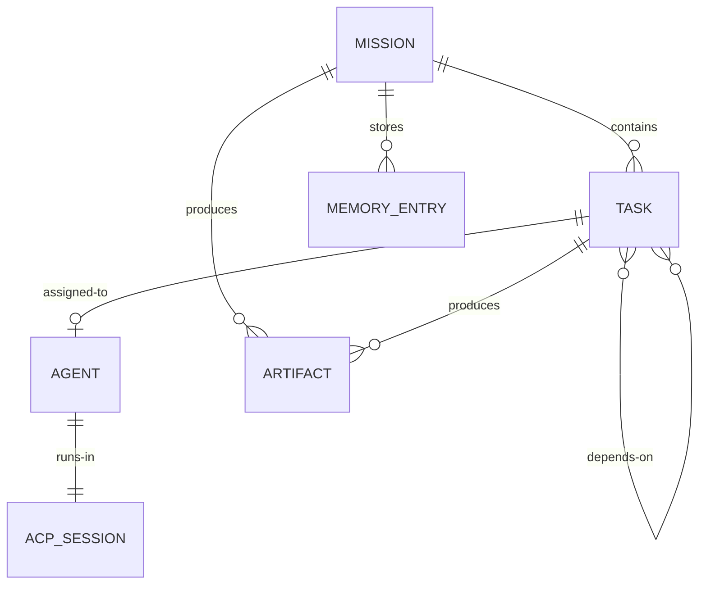

# ASF-01 — Core Concepts

## Summary

ASF models all autonomous work through four foundational entities: **Mission**, **Task**, **Agent**, and **Workflow**. These concepts form the domain vocabulary used across requirements, workflow DSL, agent contracts, and UI surfaces.

## User Story

> As an ASF operator, I want a consistent mental model for how work is defined, decomposed, executed, and tracked so that I can reason about mission progress without understanding internal implementation details.

## Core Entities

### Mission

A **Mission** represents the user's top-level objective — the "why" behind all autonomous work.

| Field | Type | Description |
|-------|------|-------------|
| `id` | UUID | Stable identifier |
| `goal` | string | Natural-language or structured objective |
| `constraints` | object | Optional: tech stack, budget, deployment target, deadlines |
| `status` | enum | `PENDING`, `RUNNING`, `BLOCKED`, `SUCCESS`, `FAILED`, `CANCELLED` |
| `createdAt` | timestamp | Mission creation time |
| `completedAt` | timestamp | Nullable; set on terminal status |

**Lifecycle:** Created → Running → (Blocked | Success | Failed | Cancelled)

**Example:**

```yaml
mission:
  id: "m-7f3a2b1c-4d5e-6f7a-8b9c-0d1e2f3a4b5c"
  goal: "Build a CRM for small businesses"
  constraints:
    stack: ["typescript", "bun", "react"]
    deployment: "cloudflare"
    maxRetries: 3
  status: RUNNING
```

### Task

A **Task** is the smallest independently executable unit of work within a mission. Tasks are created by the Task Planner (FR-05) and scheduled by the Workflow Engine.

| Field | Type | Description |
|-------|------|-------------|
| `id` | UUID | Stable identifier |
| `missionId` | UUID | Parent mission reference |
| `type` | enum | e.g., `research`, `architecture`, `implement-backend`, `test-browser` |
| `title` | string | Human-readable summary |
| `description` | string | Detailed instructions for the assigned agent |
| `status` | enum | **UI projection** of `latestTaskExecution(taskId).status` — not written by agents; Workflow Engine owns `TaskExecution` (see [docs/ADD.md](../docs/ADD.md) §4.1) |
| `dependencies` | UUID[] | Task IDs that must reach `SUCCESS` before this task is eligible |
| `assignedAgentType` | string | Agent specialization required |
| `retryCount` | int | Current retry attempt (see FR-15) |
| `artifacts` | string[] | Output file paths or artifact IDs produced |

**Granularity rule:** A task should be completable by a single agent in one ACP session (FR-08), typically 15–120 minutes of autonomous work. Tasks that exceed this should be split by the planner.

### Agent

An **Agent** is an autonomous worker with a defined specialization, tool access profile, and execution contract.

| Agent Type | Responsibility |
|------------|----------------|
| `requirement-discovery` | Domain research, stakeholder-style requirement elicitation |
| `research` | External documentation, GitHub, articles |
| `architect` | System design, schemas, API contracts |
| `planner` | Epic/task decomposition |
| `backend-engineer` | Server-side implementation |
| `frontend-engineer` | UI implementation |
| `infra-engineer` | CI/CD, IaC, environment configuration |
| `testing` | Test generation and execution |
| `fix` | Defect analysis and remediation |
| `deployment` | Target-environment deployment |
| `verification` | Post-deploy validation (FR-17) |

**Agent instance fields:**

| Field | Type | Description |
|-------|------|-------------|
| `id` | UUID | Instance identifier |
| `type` | string | Agent specialization |
| `taskId` | UUID | Currently assigned task |
| `status` | enum | `CREATED`, `ASSIGNED`, `RUNNING`, `COMPLETED`, `FAILED` |
| `acpSessionId` | string | Isolated execution context (FR-08) |

See [framework/agent-framework.md](./framework/agent-framework.md) for lifecycle details.

### Workflow

A **Workflow** is a directed acyclic graph (DAG) of tasks representing the standard SDLC pipeline:

```
Requirements → Research → Architecture → Planning → Implementation → Testing → Deployment → Verification
```

Workflows are not hard-coded per mission; the Task Planner instantiates a mission-specific DAG from requirements and architecture artifacts. The Workflow Engine (see [framework/workflow-engine.md](./framework/workflow-engine.md)) manages state transitions and scheduling.

**Workflow properties:**

- **Directed:** Edges represent dependency relationships (FR-06).
- **Acyclic:** Circular dependencies are rejected at planning time.
- **Partially parallel:** Independent branches execute concurrently when agent capacity allows.
- **Durable:** State persists across process failures.

## Relationships



## Requirements

1. Every task MUST belong to exactly one mission.
2. Every running agent MUST be assigned to exactly one task.
3. Task dependency graphs MUST be acyclic; cycles MUST be rejected with a planner error.
4. Mission status MUST be derivable from **latest `TaskExecution` status per task** (see derivation rules in workflow-engine.md and [docs/workflow-dsl.md](../docs/workflow-dsl.md) §5.5).
5. All entities MUST be addressable by stable UUIDs across restarts.
6. Entity schemas MUST be versioned to support forward-compatible migrations.

## Mission Status Derivation

| Condition | Mission Status |
|-----------|----------------|
| All tasks' latest execution `SUCCESS` **and** `verify-deployment` execution `SUCCESS` with FR-17 report `status: verified` | `SUCCESS` |
| Any latest execution `BLOCKED`, none `RUNNING` | `BLOCKED` |
| Any latest execution `FAILED` with retries exhausted | `FAILED` |
| Any `RUNNING` or eligible `PENDING` | `RUNNING` |
| Mission just created, no execution started | `PENDING` |

## Inputs / Outputs / Artifacts

| Entity | Persisted Where | Format |
|--------|-----------------|--------|
| Mission | Mission store (DB) | JSON / YAML |
| Task | Workflow store (DB) | JSON |
| Agent instance | Agent registry (DB) | JSON |
| Workflow DAG | Workflow store (DB) | Adjacency list or JSON graph |

## Acceptance Criteria

- [ ] Mission, Task, Agent, and Workflow entities are defined in a shared schema package
- [ ] UI can render mission → task → agent hierarchy from persisted state
- [ ] Task dependency graph can be visualized as a DAG
- [ ] Mission status correctly reflects aggregate task state
- [ ] Entity IDs are immutable for the lifetime of a mission

## Dependencies

- [framework/workflow-engine.md](./framework/workflow-engine.md)
- [framework/agent-framework.md](./framework/agent-framework.md)
- [functional/FR-05-task-planner.md](./functional/FR-05-task-planner.md)
- [functional/FR-06-dependency-management.md](./functional/FR-06-dependency-management.md)

## Non-Goals

- Defining agent prompt templates (deferred to Agent Contracts)
- Implementing persistence layer (deferred to ADD)
- Multi-mission program management (see future enhancements)

## Open Questions

1. Should tasks support sub-tasks (hierarchical) or only flat tasks with epic grouping metadata?
2. Can multiple agents collaborate on a single task, or is 1:1 assignment strict?
3. Should `WAITING` distinguish "waiting on dependency" vs "waiting on external resource"?

## Examples

**Minimal mission file (FR-01 input):**

```yaml
# mission.yaml
goal: "Build a CRM for small businesses"
constraints:
  deployment: cloudflare
  database: d1
  auth: better-auth
```

**Task after planning:**

```yaml
task:
  id: "t-a1b2c3d4-..."
  missionId: "m-7f3a2b1c-..."
  type: implement-backend
  title: "Implement contact CRUD API endpoints"
  status: PENDING
  dependencies: ["t-schema-migration-...", "t-openapi-finalize-..."]
  assignedAgentType: backend-engineer
```
