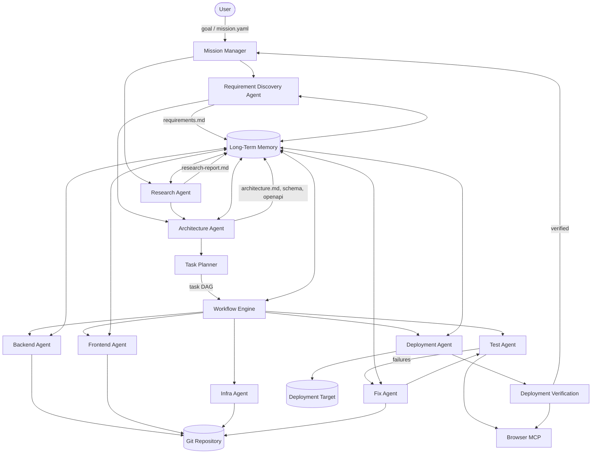
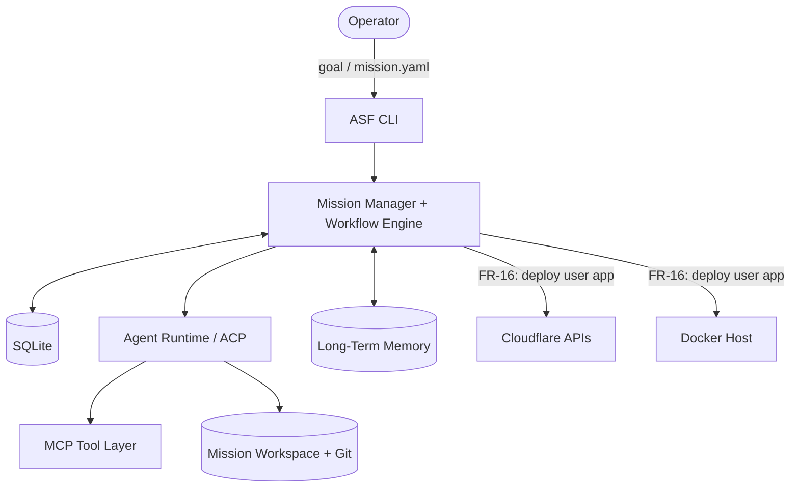

# ASF-02 — Proposed Architecture

> **⚠️ SUPERSEDED:** Component boundaries, data flow, and orchestration decisions are authoritative in [`docs/ADD.md`](../docs/ADD.md). This document remains as historical product narrative; do not implement from this diagram without cross-checking ADD.

## Summary

ASF is organized as a pipeline of orchestrated agents coordinated by a Mission Manager and Workflow Engine, with MCP-based tool access, ACP-isolated execution, durable state, and a self-healing feedback loop. This document defines component boundaries, data flow, and integration points for engineering design.

## System Story

> As the ASF platform, I route a user goal through discovery, design, planning, implementation, testing, fixing, deployment, and verification — persisting artifacts at each stage, scheduling tasks based on dependencies, and recovering from failures within retry policy.

## Architecture Diagram



## ASCII Flow (PRD Reference)

```
User
  → Mission Manager
    → Requirement Discovery Agent
    → Research Agent
    → Architecture Agent
      → Task Planner
        → Workflow Engine
          → Backend Agent
          → Frontend Agent
          → Infra Agent
            → Test Agent
              → Browser MCP
                → Fix Agent (on failure)
                  → Deployment Agent
                    → Verification
                      → Mission Done
```

## Component Responsibilities

### Mission Manager

- Entry point for mission creation (FR-01)
- Owns mission lifecycle and terminal status
- Triggers initial discovery agents sequentially or in parallel
- Invokes Task Planner after architecture phase
- Marks mission `SUCCESS` only after deployment verification passes

### Discovery & Design Agents (FR-02, FR-03, FR-04)

| Agent | Input | Output |
|-------|-------|--------|
| Requirement Discovery | Mission goal | `requirements.md` |
| Research | Requirements + goal | `research-report.md` |
| Architecture | Requirements + research | `architecture.md`, `database-schema.md`, `openapi.yaml` |

All artifacts written to mission workspace and indexed in long-term memory (FR-18).

### Task Planner & Workflow Engine (FR-05, FR-06)

- Planner converts requirements + architecture into a task DAG
- Workflow Engine schedules eligible tasks, respects dependencies, supports parallel execution
- On task completion, triggers autonomous continuation (FR-20)

### Implementation Agents (FR-07, FR-09)

- Backend, Frontend, and Infra agents execute in isolated ACP sessions (FR-08)
- Code changes committed via Git Operations (FR-10)
- Agents retrieve relevant context from memory before execution (FR-19)

### Quality Loop (FR-12, FR-13, FR-14, FR-15)

```
Test Agent → (pass) → continue workflow
           → (fail) → Failure Detection → Self-Healing (Fix Agent) → Retry Policy → re-test
```

Browser MCP (FR-11) is invoked by Test Agent for UI validation.

### Deployment Pipeline (FR-16, FR-17)

- Deployment Agent deploys **generated user applications** to configured targets (Cloudflare, Docker for v1)
- **Cloudflare is a deploy target only in v1** — the ASF platform itself does not run on Workers/D1 (see [v1 Local Topology](#v1-local-topology))
- Verification agent checks reachability, API health, UI, auth
- Results stored in memory and surfaced in UI

## v1 Local Topology

In v1, the ASF **platform** runs on a single operator machine: CLI entry, orchestration engine, and durable state colocated. Cloudflare (and Docker) are **outbound deploy targets** for mission-built apps — not hosts for Mission Manager or Workflow Engine.



| Component | v1 location |
|-----------|-------------|
| CLI, Mission Manager, Workflow Engine | Local process (or single Compose stack) |
| Workflow / mission state | SQLite on same machine |
| Agent execution | Local Docker / ACP sessions |
| Cloudflare | **Deploy target only** — Workers, Pages, D1 for generated apps |

Cloudflare-hosted platform orchestration (Workers + Durable Objects + D1) is deferred — see [future/future-enhancements.md](./future/future-enhancements.md).

## Layered Architecture

```
┌─────────────────────────────────────────────────────┐
│  UI Layer (Mission Dashboard, Task View, Agent View) │
├─────────────────────────────────────────────────────┤
│  Orchestration (Mission Manager, Workflow Engine)    │
├─────────────────────────────────────────────────────┤
│  Agent Runtime (ACP sessions, agent contracts)       │
├─────────────────────────────────────────────────────┤
│  MCP Tool Layer (filesystem, git, browser, terminal) │
├─────────────────────────────────────────────────────┤
│  Persistence (workflow state, memory, artifacts)   │
├─────────────────────────────────────────────────────┤
│  External (Git remote, deployment targets, LLM APIs) │
└─────────────────────────────────────────────────────┘
```

## Data Flow

1. **Ingress:** User submits goal → Mission Manager creates mission record + workspace
2. **Discovery:** Agents produce markdown/YAML artifacts → committed to workspace + memory index
3. **Planning:** Task Planner reads artifacts → emits task DAG → Workflow Engine persists
4. **Execution:** For each eligible task → spawn ACP session → agent executes → artifacts + git commits
5. **Validation:** Test Agent runs test suites + browser flows → failures route to Fix Agent
6. **Deploy:** Deployment Agent pushes to target → Verification confirms health
7. **Completion:** Mission Manager sets `SUCCESS`, UI shows checklist complete

## Requirements

1. Components MUST communicate through well-defined interfaces (REST, gRPC, or message bus — TBD in ADD).
2. Workflow state MUST be durable and recoverable after process crash.
3. Agent execution MUST be isolated per task via ACP (FR-08).
4. All file artifacts MUST live in a mission-scoped workspace directory.
5. Git repository MUST be the source of truth for code; memory stores metadata and pointers.
6. MCP servers MUST be the sole mechanism for agents to access filesystem, git, browser, terminal, and deployment tools.
7. Mission Manager MUST NOT mark success until FR-17 verification passes.
8. Failure paths MUST be observable in monitoring (framework/monitoring.md).

## Inputs / Outputs / Artifacts

| Stage | Key Artifacts |
|-------|---------------|
| Discovery | `requirements.md`, `research-report.md` |
| Design | `architecture.md`, `database-schema.md`, `openapi.yaml` |
| Planning | `tasks.json` or workflow DB records |
| Implementation | Source code, `README.md`, config files |
| Testing | Test files, test result reports |
| Deployment | Deployment manifests, URLs, verification report |

## Acceptance Criteria

- [ ] Architecture diagram matches implemented component boundaries
- [ ] Each FR maps to at least one architectural component
- [ ] Data flow documented from mission creation to verification
- [ ] Failure/retry loop explicitly routed through Fix Agent and Retry Policy
- [ ] MCP tool access documented per agent type
- [ ] Mission workspace isolation verified (no cross-mission file leakage)

## Dependencies

- All FR-01 through FR-20
- [framework/agent-framework.md](./framework/agent-framework.md)
- [framework/workflow-engine.md](./framework/workflow-engine.md)
- [framework/mcp-integration.md](./framework/mcp-integration.md)

## Non-Goals

- Choosing specific message bus or database technology (ADD decision)
- Defining LLM provider abstraction (may use existing SDK patterns)
- Multi-region deployment architecture

## Open Questions

1. Monolith orchestrator vs. microservices for Mission Manager and Workflow Engine?
2. Should agents run in containers, sandboxes, or host processes?
3. Event sourcing for workflow state vs. CRUD with snapshots?
4. Single shared git repo per mission vs. branch-per-epic strategy?

## Integration Points

| System | Protocol | Used By |
|--------|----------|---------|
| LLM APIs | HTTPS | All agents |
| Git remote | HTTPS/SSH | FR-10, implementation agents |
| Cloudflare API | HTTPS | FR-16 (user-app deploy only; platform not hosted on CF in v1) |
| Browser (Chromium) | MCP | FR-11, FR-12, FR-17 |
| Shared Memory MCP | MCP | FR-18, FR-19 |
