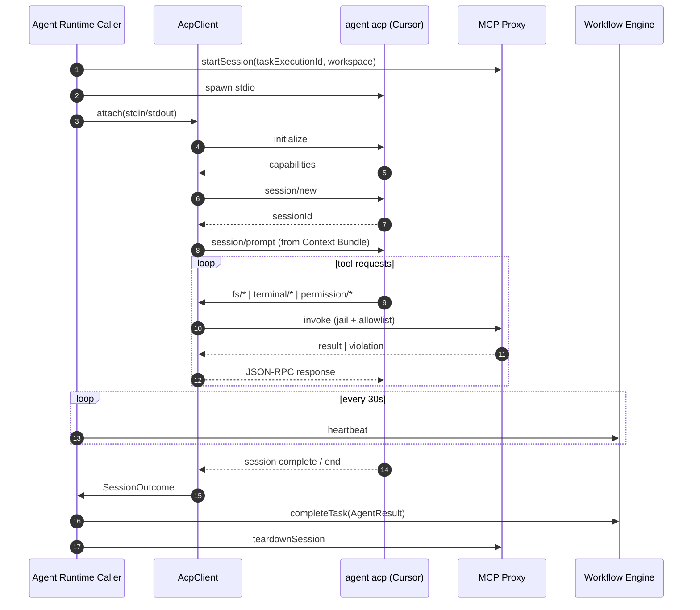

# ASF-FW-ACP — Cursor Agent Client Protocol Integration

## Summary

ASF integrates with **Cursor Agent CLI** (`agent acp`) as the v1 production agent backend via the public [**Agent Client Protocol**](https://agentclientprotocol.com) (JSON-RPC over stdio). ASF is the **ACP client**; Cursor is the **ACP agent**. Tool requests from Cursor are satisfied by forwarding to the existing MCP proxy within an **execution session** (per-task process sandbox — see [process-sandbox.md](./process-sandbox.md)).

> **Naming:** "ACP" in this document means **Agent Client Protocol** only. Per-task isolation is an **execution session** (formerly mislabeled "ACP session" in FR-08). See [ADR-003](../../docs/ADR-003-cursor-acp-primary-backend.md).

## User Story

> As an ASF operator with Cursor, I want autonomous tasks to run through the same `agent acp` interface I use manually — so the factory behaves like my IDE agent, not a separate custom LLM stack.

## System Story

> As the ACP client adapter (`packages/acp-client`), I must spawn `agent acp`, perform JSON-RPC lifecycle (`initialize`, `session/new`, `session/prompt`), handle filesystem/terminal/permission requests by delegating to MCP proxy with allowlist enforcement, auto-resolve permissions per process-sandbox policy, map session completion to `AgentResult`, and tear down the execution session on terminal states.

## Architecture



## Requirements

### Spawn & process lifecycle

1. Agent Runtime Caller MUST spawn `agent acp` as a child process with stdio pipes (no shell interpolation).
2. Child working directory MUST be the mission workspace root (`workspaces/{missionId}/` or task branch root per FR-10).
3. Child environment MUST include `CURSOR_API_KEY` when configured; MUST NOT include `ASF_INTERNAL_JWT_SECRET`, platform vault secrets, or raw deploy tokens.
4. Caller MUST start MCP proxy session **before** sending `session/prompt`.
5. On spawn failure (binary missing, immediate exit), caller MUST post `completeTask` with `error.code: SPAWN_FAILED` and `recoverable: true` (or stub fallback if `ASF_AGENT_BACKEND=custom-llm`).
6. Wall-clock timeout and lease heartbeat semantics MUST match [cli-agent-runtime.md](./cli-agent-runtime.md) — heartbeat is **caller-owned**, not delegated to Cursor.

### ACP JSON-RPC lifecycle

1. `AcpClient` MUST implement the client role per [agentclientprotocol.com](https://agentclientprotocol.com):
   - `initialize` — negotiate protocol version and client capabilities
   - `session/new` — create ACP session bound to workspace context
   - `session/prompt` — send user message derived from Context Bundle (task description, acceptance criteria, artifact references)
2. `AcpClient` MUST handle inbound requests from the agent for:
   - **Filesystem** — read, write, list (map to MCP filesystem adapter)
   - **Terminal** — exec (map to MCP terminal adapter)
   - **Permission** — approve/deny per autonomous policy (§ Permission auto-policy)
3. `AcpClient` MUST log JSON-RPC message types (not full content) to execution session telemetry.
4. On protocol parse errors, MUST terminate execution session and return `FAILED` with `error.code: ACP_PROTOCOL_ERROR`.

### Context Bundle → session/prompt mapping

1. User message MUST include: mission goal, task ID, agent type, acceptance criteria, required artifact paths (relative to workspace), and prior failure summary on retry.
2. System instructions from [agent-contracts.md](../../docs/agent-contracts.md) per `agentType@version` MUST be prepended or included per Cursor ACP session conventions.
3. Bundle MUST NOT embed secrets, internal JWTs, or absolute paths outside workspace.

### Permission auto-policy

Tied to [process-sandbox.md](./process-sandbox.md) and [security.md](./security.md):

1. For unattended factory runs (`ASF_ACP_PERMISSION_MODE=auto`, default), `AcpClient` MUST **auto-approve** permission requests that pass MCP pre-checks.
2. MUST **auto-deny** requests that would violate workspace jail, git denylist, terminal allowlist, browser URL allowlist, or agent-type tool allowlist — without invoking the tool.
3. Denied permissions MUST return a structured denial to Cursor so the model can adjust (same as MCP `TOOL_NOT_AUTHORIZED`).
4. `ASF_ACP_PERMISSION_MODE=strict` MUST deny all permission requests and mark task `FAILED` with `recoverable: false`, `code: PERMISSION_DENIED` (operator intervention path).

### completeTask mapping

1. On ACP session normal completion, `AcpClient` MUST produce `AgentResult`:
   - `status: COMPLETED` when acceptance criteria signals success (artifact checks per agent contract)
   - `status: FAILED` + `needsHealing: true` when recoverable per FR-13/FR-14
2. Caller MUST validate `AgentResult` against `agent-result.v1.json` before `POST /internal/v1/tasks/{taskExecutionId}/complete`.
3. Token usage and duration MUST be copied from ACP session metadata when available; otherwise estimate from wall clock.
4. `executionSessionId` (legacy field `acpSessionId`) MUST be recorded on the completion payload and `task.started` event.
5. Cursor MUST NOT call Workflow Engine HTTP directly — only the caller posts `completeTask`.

### Backend selection

| `ASF_AGENT_BACKEND` | Behavior |
|---------------------|----------|
| `cursor-acp` (default when `agent` on PATH) | Spawn `agent acp` + `AcpClient` |
| `custom-llm` | M3 `asf agent run` LLM loop (fallback) |
| (with `ASF_USE_STUB_AGENTS=1`) | In-process stub — no spawn |

## Inputs / Outputs / Artifacts

| Direction | Name | Format |
|-----------|------|--------|
| Input | Context Bundle | JSON ([FR-19](../functional/FR-19-knowledge-retrieval.md)) |
| Input | `CURSOR_API_KEY` | env (operator config) |
| Output | `executionSessionId` | UUID string |
| Output | ACP telemetry | JSONL per `taskExecutionId` |
| Output | `AgentResult` | `agent-result.v1.json` |

## Acceptance Criteria

- [ ] `agent acp` spawned with stdio; `initialize` → `session/new` → `session/prompt` succeeds in integration test (mock or recorded JSON-RPC)
- [ ] Filesystem tool request for `../../../etc/passwd` auto-denied at MCP layer before permission approve
- [ ] Terminal `git push` auto-denied per git denylist
- [ ] Allowlisted `bun test` in workspace auto-approved and executed
- [ ] Session completion maps to `AgentResult` and `completeTask` POST with valid execution JWT
- [ ] `ASF_USE_STUB_AGENTS=1` CI path unchanged — no `CURSOR_API_KEY` required
- [ ] `ASF_AGENT_BACKEND=custom-llm` runs M3 pilot without `agent` binary
- [ ] Heartbeat extends lease every 30s for duration of ACP session
- [ ] Execution session teardown reaps child + MCP session within 60s

## Dependencies

- [ADR-003](../../docs/ADR-003-cursor-acp-primary-backend.md) — decision record
- FR-07 — Agent types and tool allowlists
- FR-08 — Execution session isolation (not Agent Client Protocol)
- FR-19 — Context bundle
- [cli-agent-runtime.md](./cli-agent-runtime.md) — Caller spawn contract
- [process-sandbox.md](./process-sandbox.md) — Jail and allowlists
- [mcp-integration.md](./mcp-integration.md) — MCP proxy adapters (M4)

## Non-Goals

- Implementing the ACP **agent** side (Cursor owns this)
- Claude Code / other ACP agents (follow-on ADR)
- Interactive permission UI mid-mission (v1)
- Replacing MCP proxy with direct host syscalls

## Open Questions

1. Exact ACP method names for filesystem/terminal — follow Cursor CLI release; wrap with version negotiation in `initialize`.
2. Structured `AgentResult` extraction from Cursor session end vs. post-hoc artifact validation?
3. Per-agent-type Cursor model selection — env table vs. Cursor defaults?

## Examples

**Permission auto-approve (filesystem write in workspace):**

```json
{
  "jsonrpc": "2.0",
  "method": "permission/request",
  "params": {
    "kind": "filesystem.write",
    "path": "packages/api/src/routes/contacts.ts"
  },
  "id": 42
}
```

→ MCP path check passes → response `{ "approved": true }`

**Session prompt excerpt (from bundle):**

```text
Task: t-contacts-api (backend-engineer)
Mission: Build a CRM for small businesses

Implement /api/contacts CRUD per artifacts/openapi.yaml.
Acceptance: bun test packages/api passes; changes on branch task/t-contacts-api.

Artifacts: artifacts/openapi.yaml, artifacts/database-schema.md
```
