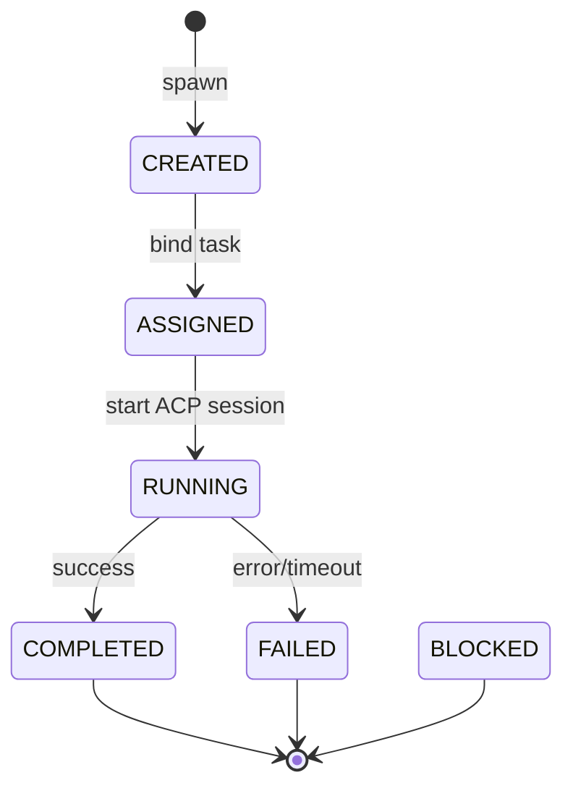

# ASF-FW-01 — Agent Framework

## Summary

The Agent Framework defines the lifecycle, context model, recovery semantics, and execution contracts for all autonomous agents in ASF — ensuring consistent behavior across agent types and reliable state management.

## User Story

> As an ASF developer, I need a uniform agent lifecycle and context contract so that every agent type integrates with the workflow engine and ACP runtime the same way.

## System Story

> As the Agent Framework runtime, I must instantiate agents, bind context, manage lifecycle transitions, handle failures with recovery paths, and report outcomes to the workflow engine.

## Agent Lifecycle



> **Healing ownership:** On `FAILED` with `recoverable: true`, the Agent Runtime reports via `completeTask`; the **Workflow Engine** spawns healing-child tasks (FR-14). Agents do not self-transition `FAILED → ASSIGNED`.

### State Definitions

| State | Description |
|-------|-------------|
| `CREATED` | Agent instance exists, no task bound |
| `ASSIGNED` | Task bound, context retrieved (FR-19), awaiting execution |
| `RUNNING` | ACP session active, tools in use |
| `COMPLETED` | Task finished successfully, artifacts reported |
| `FAILED` | Execution error; terminal for this agent instance. Retry/healing owned by Workflow Engine (FR-14, FR-15) |
| `BLOCKED` | Unrecoverable or retries exhausted; human needed |

## Context Model

Every agent receives a **Context Bundle** at assignment (FR-19):

```typescript
interface AgentContext {
  mission: {
    id: string;
    goal: string;
    constraints: Record<string, unknown>;
  };
  task: {
    id: string;
    type: string;
    title: string;
    description: string;
    acceptanceCriteria: string[];
    dependencies: string[];
  };
  artifacts: Array<{ path: string; summary?: string }>;  // summary-only; full content via FR-19 retrieval
  memory: Array<{ kind: string; content: string; relevance: number }>;
  priorFailures: FailureReport[];
  workspace: string;
}
```

## Requirements

1. All agents MUST implement a standard execution contract:

```typescript
interface AgentContract {
  type: string;
  execute(context: AgentContext, acp: ACPSession): Promise<AgentResult>;
}

interface AgentResult {
  status: "COMPLETED" | "FAILED";
  artifacts: string[];
  commits: string[];
  summary: string;
  error?: { code: string; message: string; recoverable: boolean };
}
```

2. Agent contracts MUST be versioned: `{ type, version }` pinned at mission start.
3. Lifecycle transitions MUST be logged with timestamps and emitted as events.
4. Recovery path on `FAILED`:
   - Agent Runtime reports `completeTask` with failure payload
   - Workflow Engine evaluates FR-15 and spawns healing-child tasks (FR-14) — not the agent framework directly
   - If retries exhausted → engine sets parent `TaskExecution` `BLOCKED` or `FAILED`
   - If `non-recoverable` → engine `BLOCKED` immediately
5. Agent instances MUST be garbage-collected 24 hours after terminal state.
6. Concurrent agent limit enforced per type (FR-07).
7. Agent execution timeout enforced by ACP session (FR-08).
8. All agents MUST report token usage and duration on completion.

## Inputs / Outputs / Artifacts

| Direction | Name | Format |
|-----------|------|--------|
| Input | Task assignment | JSON |
| Input | Context bundle | AgentContext |
| Output | Agent instance record | DB JSON |
| Output | Lifecycle events | Event stream |
| Output | AgentResult | JSON |

## Acceptance Criteria

- [ ] Lifecycle state machine implemented per diagram
- [ ] All agent types implement AgentContract interface
- [ ] Context bundle populated before ASSIGNED → RUNNING transition
- [ ] Failed agent with recoverable error triggers engine healing-child subgraph (FR-14), not agent `FAILED → ASSIGNED`
- [ ] Token usage recorded per agent execution
- [ ] Agent View UI shows lifecycle state in real-time

## Dependencies

- FR-07 — Agent types
- FR-08 — ACP sessions
- FR-14, FR-15 — Recovery and retry
- FR-19 — Context retrieval

## Non-Goals

- Agent plugin marketplace (future)
- Custom agent authoring UI (v1)
- Multi-agent negotiation protocols

## Open Questions

1. Agent contract storage: code registry vs. config files?
2. Graceful cancellation mid-execution?
3. Agent warm pools for faster startup?

## Examples

**Lifecycle event:**

```json
{
  "event": "agent.lifecycle",
  "agentId": "a-9f8e7d6c",
  "taskId": "t-contacts-api",
  "transition": { "from": "ASSIGNED", "to": "RUNNING" },
  "timestamp": "2026-06-22T10:00:00Z"
}
```

**Agent contract registration:**

```yaml
agents:
  - type: backend-engineer
    version: "1.0.0"
    contract: contracts/backend-engineer.v1.md
    mcp_tools: [filesystem, git, terminal, memory, database]
    timeout_ms: 7200000
    max_concurrent: 2
```
