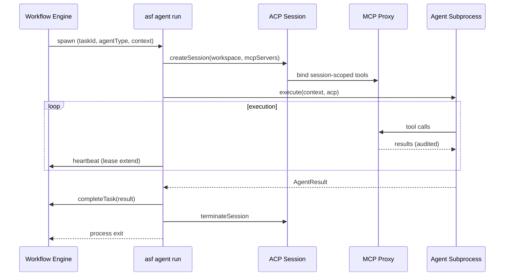

# ASF-FW-CLI — CLI Agent Runtime

## Summary

The CLI Agent Runtime is the local-first operator surface for ASF. The `asf` CLI creates missions, starts workflow orchestration, spawns agent subprocesses per task, and reports outcomes to the Workflow Engine HTTP API — enabling a Cursor/Claude Code-style agent experience without requiring a hosted control plane for v1.

## User Story

> As a developer running ASF on my machine, I want a single `asf` CLI to create missions, start autonomous execution, and inspect status — so I can drive the full SDLC from my terminal without managing individual agent processes manually.

## System Story

> As the CLI Agent Runtime, I must parse operator commands, provision mission workspaces, call Workflow Engine APIs for scheduling state, spawn isolated agent subprocesses bound to ACP sessions, relay `completeTask` results, and exit cleanly when tasks finish or fail.

## CLI Command Surface

### `asf mission create`

1. MUST accept a natural-language goal (`--goal`) or structured mission file (`--file mission.yaml`).
2. MUST create a mission record and workspace at `workspaces/{missionId}/`.
3. MUST initialize workspace scaffolding: `mission.yaml`, `artifacts/`, `tasks/`, `.asf/`.
4. MUST output `{ missionId, workspacePath }` as JSON (default) or human-readable summary (`--format text`).
5. On validation failure (empty goal, invalid YAML), MUST exit with code `1`.

### `asf mission start`

1. MUST call Workflow Engine `POST /internal/v1/missions/{missionId}/start`.
2. MUST block until the engine acknowledges scheduling (`202 Accepted` or equivalent) unless `--detach` is set.
3. With `--detach`, MUST return immediately after start is accepted; operator polls via `mission status`.
4. MUST NOT spawn agents directly — scheduling is owned by the Workflow Engine (FR-20).

### `asf mission status`

1. MUST call Workflow Engine `GET /internal/v1/missions/{missionId}` and `GET /internal/v1/missions/{missionId}/tasks`.
2. MUST display: mission status, progress (`completed/total`, percent), running tasks, blocked/failed tasks with error summaries.
3. MUST support `--watch` for streaming progress events (SSE or polling).
4. MUST exit `0` for `SUCCESS`, `1` for `FAILED`/`BLOCKED`, `2` for `RUNNING` (useful in scripts).

### `asf agent run`

1. MUST be invoked by the Workflow Engine (or operator for debugging) with: `--mission-id`, `--task-id`, `--agent-type`, `--context-bundle` (path or stdin JSON).
2. MUST spawn an agent subprocess lifecycle:
   ```
   spawn → bind ACP session → execute AgentContract → completeTask → exit
   ```
3. MUST create one ACP session per invocation (FR-08) using the process sandbox model ([process-sandbox.md](./process-sandbox.md)).
4. MUST call Workflow Engine `POST /internal/v1/tasks/{taskExecutionId}/complete` with `AgentResult` payload on terminal states.
5. MUST heartbeat lease per [workflow-engine.md](./workflow-engine.md) § lease and heartbeat while `RUNNING`.
6. MUST exit with code `0` on `COMPLETED`, non-zero on `FAILED` or lease timeout.
7. MUST stream structured logs to stdout (JSON lines) when `--log-format json`.

### `asf server start`

1. MUST start the local ASF control plane: Workflow Engine HTTP API, MCP proxy, and optional Mission Dashboard UI.
2. MUST bind to configurable host/port (default: `127.0.0.1:7432`).
3. MUST persist workflow state to local store (SQLite or equivalent) under `.asf/` or operator-configured path.
4. MUST authenticate internal API calls per [security.md](./security.md) § Internal API Authentication.
5. MUST support `--foreground` (default) and `--daemon` modes.

## Agent Subprocess Lifecycle



### Lifecycle Requirements

1. **Spawn:** Workflow Engine invokes `asf agent run` as a child process with task-scoped env (non-secret config only).
2. **MCP session:** CLI runtime creates ACP session, injects FR-19 context bundle, connects authorized MCP servers per agent type (FR-07).
3. **Execute:** Agent implements `AgentContract` ([agent-framework.md](./agent-framework.md)); tools are MCP-only — no direct host syscalls.
4. **Complete:** CLI posts `AgentResult` to Workflow Engine; engine is sole task-state writer.
5. **Exit:** ACP session terminated within 60 seconds; subprocess exit code reflects outcome.

## Workspace Layout

```
workspaces/{missionId}/
├── mission.yaml              # Mission definition and constraints
├── artifacts/                # Generated docs, schemas, reports
│   ├── requirements.md
│   ├── architecture.md
│   └── openapi.yaml
├── tasks/
│   └── plan.json             # Planner output (FR-05)
├── src/                      # Generated application code (mission-specific)
├── .asf/
│   ├── state.db              # Local workflow cache (optional mirror)
│   ├── sessions/             # Per-session telemetry logs
│   └── events/               # Event log for --watch
└── .git/                     # Mission branch (FR-10)
```

1. All agent filesystem MCP operations MUST be scoped to `workspaces/{missionId}/` (see [process-sandbox.md](./process-sandbox.md)).
2. Mission ID MUST be a stable UUID; workspace path MUST be deterministic from mission ID.
3. CLI `mission create` MUST create the directory tree atomically (rollback on failure).

## Workflow Engine HTTP API Integration

| CLI Command | Engine Endpoint | Purpose |
|-------------|-----------------|---------|
| `mission start` | `POST /internal/v1/missions/{id}/start` | Begin scheduling (FR-20) |
| `mission status` | `GET /internal/v1/missions/{id}` | Mission aggregate status |
| `mission status` | `GET /internal/v1/missions/{id}/tasks` | Task execution states |
| `agent run` | `POST /internal/v1/tasks/{id}/heartbeat` | Lease extension |
| `agent run` | `POST /internal/v1/tasks/{id}/complete` | Report `AgentResult` |
| `server start` | (hosts) `/internal/v1/*` | Control plane |

1. CLI MUST use service authentication (JWT bearer) for all `/internal/v1/*` calls when not running in-process.
2. Agent subprocesses MUST NOT receive internal API tokens — only the CLI parent or engine-side proxy may call internal APIs.
3. API contract details: [docs/workflow-dsl.md](../../docs/workflow-dsl.md), [docs/ADD.md](../../docs/ADD.md) §10.

## Requirements

1. The `asf` binary MUST be the primary v1 operator interface; API and UI are secondary surfaces.
2. Agent execution MUST occur via `asf agent run` subprocess spawn, not in-process within the Workflow Engine.
3. One agent subprocess per task execution attempt (including retries); retries spawn new subprocesses with new ACP sessions.
4. CLI MUST support `ASF_HOME` (default: `~/.asf`) for global config, credentials, and server state.
5. CLI MUST support `ASF_WORKSPACE_ROOT` (default: `./workspaces`) for mission workspace root.
6. Operator-facing commands (`mission *`) MUST NOT require internal API tokens; they authenticate via local operator session established at `server start`.
7. `asf agent run` MUST enforce FR-08 session timeout; on timeout, post `FAILED` with `recoverable: true` and exit non-zero.
8. CLI MUST redact secrets in all stdout/stderr logs per [security.md](./security.md).
9. `asf server start` and `asf mission start` MUST work offline for local missions (no cloud dependency for orchestration).
10. CLI version MUST be reported in agent telemetry for contract debugging.

## Inputs / Outputs / Artifacts

| Direction | Name | Format |
|-----------|------|--------|
| Input | Operator commands | CLI argv + flags |
| Input | Mission file | YAML (`mission.yaml`) |
| Input | Context bundle | JSON (FR-19) |
| Output | Mission record | DB + `workspaces/{missionId}/` |
| Output | Agent subprocess logs | JSON lines |
| Output | `completeTask` payload | `AgentResult` JSON |
| Output | CLI exit codes | `0` success, `1` failure, `2` in-progress |

## Acceptance Criteria

- [ ] `asf mission create --goal "Build a CRM"` creates workspace and prints `missionId`
- [ ] `asf server start` exposes Workflow Engine on `127.0.0.1:7432`
- [ ] `asf mission start {id}` triggers FR-20 continuation without manual per-task commands
- [ ] `asf mission status {id}` shows accurate task states after agent completions
- [ ] `asf agent run` spawns subprocess, completes MCP session, posts `completeTask`, exits `0` on success
- [ ] Retry spawns new `asf agent run` process with new `acpSessionId` and prior failure context
- [ ] Agent subprocess cannot write outside `workspaces/{missionId}/`
- [ ] CRM reference mission runnable end-to-end via CLI only (no UI required)
- [ ] `asf mission status --watch` streams progress events during execution

## Dependencies

- FR-07 — Agent types and capability matrix
- FR-08 — ACP session isolation (process-per-session v1)
- FR-20 — Autonomous continuation after `completeTask`
- [agent-framework.md](./agent-framework.md) — AgentContract and lifecycle
- [workflow-engine.md](./workflow-engine.md) — Scheduling, leases, `completeTask`
- [process-sandbox.md](./process-sandbox.md) — v1 isolation model
- [mcp-integration.md](./mcp-integration.md) — MCP proxy and allowlists
- [security.md](./security.md) — Auth, secrets, allowlists

## Non-Goals

- Remote/cloud-hosted CLI targeting multi-tenant control plane (v1)
- Interactive REPL agent chat mode (distinct from mission-driven `agent run`)
- In-process agent execution inside Workflow Engine
- Container orchestration from CLI (deferred to Phase 2 — see [security.md](./security.md))
- Windows native support in v1 (macOS/Linux first)

## Open Questions

1. Should `asf agent run` support `--dry-run` for contract validation without LLM calls?
2. Default SQLite vs. Postgres for `server start` local persistence?
3. Plugin mechanism for custom agent binaries beyond built-in registry?

## Examples

**Create and start a mission:**

```bash
asf server start --daemon
MISSION=$(asf mission create --goal "Build a CRM for small businesses" --format json | jq -r .missionId)
asf mission start "$MISSION" --detach
asf mission status "$MISSION" --watch
```

**Engine-spawned agent invocation (internal):**

```bash
asf agent run \
  --mission-id m-7f3a2b1c-... \
  --task-id t-contacts-api \
  --agent-type backend-engineer \
  --context-bundle /workspaces/m-7f3a2b1c-.../.asf/context/t-contacts-api.json \
  --log-format json
```

**`completeTask` payload (posted by CLI on success):**

```json
{
  "taskExecutionId": "te-4a3b2c1d-...",
  "result": {
    "status": "COMPLETED",
    "artifacts": ["src/api/routes/contacts.ts"],
    "commits": ["abc1234"],
    "summary": "Implemented CRUD endpoints per openapi.yaml"
  },
  "acpSessionId": "acp-s-9f8e7d6c-...",
  "metrics": { "durationMs": 2700000, "tokensIn": 45000, "tokensOut": 12000 }
}
```
