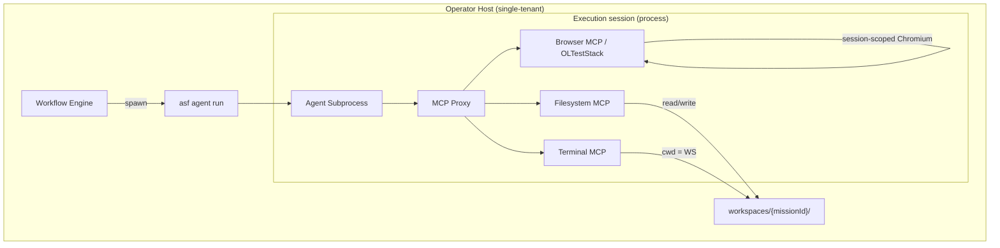

# ASF-FW-SBX — Process Sandbox

> **Naming:** **Execution session** = per-task process sandbox below. **Agent Client Protocol (ACP)** = JSON-RPC wire protocol between ASF and Cursor `agent acp` — see [acp-cursor-integration.md](./acp-cursor-integration.md). Do not conflate the two.

## Summary

ASF v1 uses a **process-per-session** sandbox model for **execution session** isolation — no Docker containers required. Each agent task runs in a dedicated OS subprocess with workspace-scoped filesystem access, MCP-only tool surface, terminal argv allowlists, and session-scoped browser instances. This model supersedes container-per-session as the v1 default for local, single-operator deployments.

## User Story

> As a local ASF operator, I want agents to run in isolated subprocesses on my machine without Docker overhead — so I can iterate quickly while still preventing cross-task interference and workspace escape.

## System Story

> As the Process Sandbox runtime, I must spawn one OS process per **execution session**, enforce workspace boundaries at the MCP proxy, scope browser and terminal tools per session, inject secrets only at MCP boundaries, and tear down all child resources on session termination.

## v1 Sandbox Model (No Docker)



### Design Rationale

| Aspect | Process Sandbox (v1) | Container-per-Session (Phase 2) |
|--------|----------------------|----------------------------------|
| Startup latency | Low (fork/exec) | Higher (image pull, container create) |
| Isolation strength | MCP boundary + OS user | Kernel namespace isolation |
| Operator model | Single trusted operator | Untrusted missions / multi-tenant |
| Dependencies | None (no Docker daemon) | Docker/Podman runtime required |
| Use case | Local dev, founder laptop | Shared platform, external missions |

> **Supersedes:** Prior v1 default of container-per-session ([FR-08](../functional/FR-08-acp-integration.md), [security.md](./security.md) § P0 Container Isolation) is deferred to **Phase 2** for untrusted missions. See [security.md](./security.md) § v1 Local Operator Mode.

## Requirements

### Process Isolation

1. Each ACP session MUST run in a **dedicated OS subprocess** spawned by `asf agent run` ([cli-agent-runtime.md](./cli-agent-runtime.md)).
2. Sessions MUST NOT share: in-memory agent state, terminal shells, browser instances, or git index locks (FR-08).
3. Session lifecycle: `CREATED → ACTIVE → TERMINATED` (success) or `CREATED → ACTIVE → FAILED → TERMINATED`.
4. On termination, all session child processes (browser, terminal children) MUST be reaped within 60 seconds.
5. Cross-session communication MUST occur only via persisted artifacts (files, memory MCP, git) — no IPC channels between concurrent sessions.

### Workspace Boundary

1. Filesystem MCP MUST restrict all operations to `workspaces/{missionId}/` — path traversal (`../`) MUST be rejected with `PATH_OUT_OF_BOUNDS`.
2. Terminal MCP MUST set working directory to mission workspace root; relative paths MUST NOT escape workspace.
3. Git operations MUST be scoped to the mission repository within the workspace (FR-10).
4. Process sandbox does NOT provide kernel-level filesystem isolation; enforcement is at the MCP proxy layer. Operators MUST NOT point ASF at sensitive host paths outside the workspace root.

### MCP-Only Tools

1. Agents MUST access host capabilities exclusively through authorized MCP servers (FR-07 capability matrix).
2. Direct syscalls, raw socket access, and arbitrary host file reads outside MCP are prohibited.
3. MCP proxy MUST enforce per-agent tool allowlists; unauthorized calls return `TOOL_NOT_AUTHORIZED`.
4. All tool calls MUST be audit-logged per [mcp-integration.md](./mcp-integration.md).

### Terminal argv Allowlist

1. Terminal MCP `exec` MUST validate `argv[0]` against the prefix allowlist in [security.md](./security.md) § Terminal Allowlist Policy.
2. Commands MUST be invoked via argument arrays — no shell interpolation of agent-generated strings.
3. Destructive commands (`rm -rf /`, `mkfs`, `dd`, fork bombs) MUST be blocked.
4. Network egress from terminal MUST be limited to: package registries, configured git remotes, deployment API endpoints.
5. Full `argv` MUST be logged for audit (secrets redacted).

### Browser Subprocess Lifecycle (OLTestStack)

1. Each ACP session that uses Browser MCP MUST own a dedicated Chromium instance via OLTestStack.
2. Browser lifecycle:
   ```
   browser_launch → page operations → browser_close (finally)
   ```
3. `browserId` and `pageId` MUST be session-scoped; MUST NOT be reused across sessions or hard-coded across invocations.
4. On ACP session termination, the MCP proxy MUST call `browser_close` and kill orphaned Chromium processes (FR-11).
5. Browser navigation MUST comply with URL allowlist in [security.md](./security.md) § Browser URL Allowlist.
6. Element IDs invalidate after `page_navigate` / `page_reload` — agents MUST re-discover elements.

### Secrets at MCP Boundary

1. Secrets MUST NOT appear in FR-19 context bundles, environment variables passed to agent subprocesses, or workspace files.
2. Secret injection MUST occur at MCP tool invocation time via vault proxy: `vault.get(secretRef, sessionId)`.
3. Injected secrets MUST be redacted in audit logs and agent telemetry.
4. Agents MUST NOT receive internal Workflow Engine API tokens.
5. Deploy and database MCP tools MUST fetch credentials from vault at call time — never accept secrets in tool params.

### Session Context Injection

1. At session start, ACP MUST inject (from FR-19):
   - Mission goal and constraints
   - Task description and acceptance criteria
   - Relevant memory excerpts
   - Dependency artifact paths
   - Prior failure reports (on retry)
2. Session MUST enforce timeouts: default 2 hours wall-clock, configurable per task type (FR-08).
3. Session ID MUST be recorded on agent instance and task execution record.

## Inputs / Outputs / Artifacts

| Direction | Name | Format |
|-----------|------|--------|
| Input | Task assignment + context bundle | JSON |
| Input | Agent type + MCP server list | FR-07 registry |
| Output | `acpSessionId` | UUID string |
| Output | Session telemetry | JSON log stream |
| Output | Session summary | Token count, duration, tool call count |
| Output | Sandbox violation events | `PATH_OUT_OF_BOUNDS`, `TOOL_NOT_AUTHORIZED`, etc. |

## Acceptance Criteria

- [ ] Two concurrent tasks have distinct `acpSessionId` values and distinct OS PIDs
- [ ] Filesystem MCP rejects writes to `../../etc/passwd` from within session
- [ ] Terminal rejects non-allowlisted `argv[0]` with `COMMAND_NOT_ALLOWLISTED`
- [ ] Browser MCP launches separate Chromium per session; no zombie processes after termination
- [ ] Secrets never appear in agent logs, git history, or context bundles (automated test)
- [ ] Session timeout kills agent subprocess and marks task `FAILED` (recoverable)
- [ ] Retry creates new process with new session ID and prior failure context injected
- [ ] `browser_close` called on session teardown even after agent failure

## Dependencies

- FR-07 — Agent types and MCP allowlists
- FR-08 — ACP session contract (process model)
- FR-11 — Browser MCP / OLTestStack conformance
- FR-19 — Context bundle injection
- [cli-agent-runtime.md](./cli-agent-runtime.md) — Subprocess spawn and `completeTask`
- [mcp-integration.md](./mcp-integration.md) — MCP proxy enforcement
- [security.md](./security.md) — Allowlists, vault, Phase 2 container isolation

## Non-Goals

- **Kernel-level isolation** — no cgroups/namespaces requirement in v1
- **Multi-tenant mission isolation** — single trusted operator per host (Phase 2)
- **Docker/container runtime** — not required for v1 local operator mode
- **gVisor/Firecracker** — deferred to Phase 2
- **Interactive human takeover mid-session** (v1)
- **Session recording playback UI** (v1)

## Open Questions

1. Optional macOS sandbox (`sandbox-exec`) or Linux `landlock` as defense-in-depth without Docker?
2. Per-session OS user drop privileges — worth the complexity for v1?
3. Maximum concurrent browser instances per host before resource throttling?

## Examples

**Session creation (process model):**

```json
{
  "taskId": "t-contacts-api",
  "agentType": "backend-engineer",
  "isolation": "process",
  "pid": 48291,
  "workspace": "workspaces/m-7f3a2b1c-.../",
  "mcpServers": ["filesystem", "git", "terminal", "memory", "database"],
  "context": {
    "missionGoal": "Build a CRM for small businesses",
    "taskDescription": "Implement /api/contacts CRUD per openapi.yaml",
    "artifacts": ["artifacts/openapi.yaml", "artifacts/database-schema.md"]
  },
  "timeoutMs": 7200000
}
```

**Path traversal rejection:**

```json
{
  "tool": "filesystem.write",
  "path": "../../../.ssh/id_rsa",
  "error": "PATH_OUT_OF_BOUNDS",
  "sessionId": "acp-s-4a3b2c1d-..."
}
```

**Browser session teardown:**

```json
{
  "event": "acp.session.terminate",
  "acpSessionId": "acp-s-4a3b2c1d-...",
  "actions": [
    { "tool": "browser_close", "browserId": "br-8a7b6c5d-..." },
    { "signal": "SIGTERM", "pid": 48291 },
    { "reaped": true, "durationMs": 1200 }
  ]
}
```
