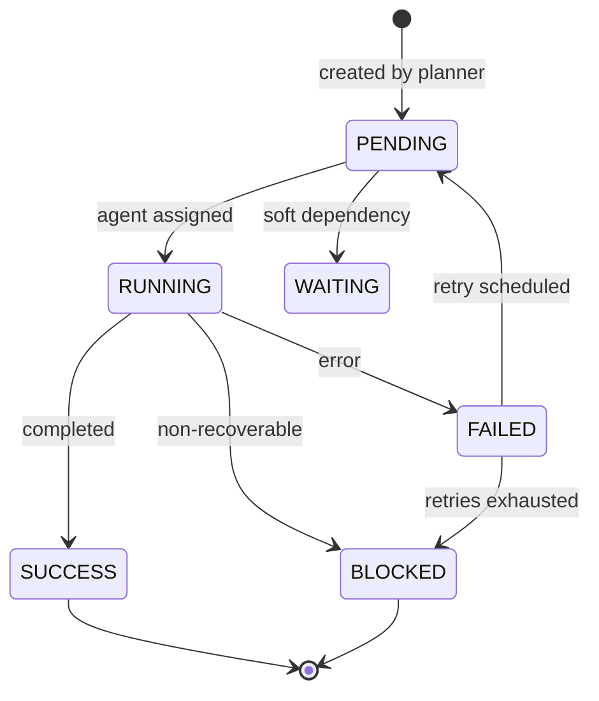

# ASF-FW-02 — Workflow Engine

## Summary

The Workflow Engine manages task state machines, dependency-aware scheduling, parallel execution, and durable persistence — serving as the orchestration backbone that drives missions from first task to completion.

## User Story

> As the ASF platform, I need a reliable workflow engine that knows which tasks can run, tracks their state, and survives crashes so missions don't lose progress.

## System Story

> As the Workflow Engine, I must persist task states, process completion events, schedule eligible work, enforce concurrency limits, and derive mission-level status from task aggregates.

## Task States



| State | Description |
|-------|-------------|
| `PENDING` | Created, dependencies met (or none), awaiting scheduling |
| `RUNNING` | Agent actively executing |
| `WAITING` | Blocked on soft dependency or external resource |
| `BLOCKED` | Requires human intervention |
| `FAILED` | Execution failed; may retry |
| `SUCCESS` | Completed with acceptance criteria met |

## Scheduling

### Sequential Execution
Tasks with linear dependencies execute in order:
```
t-setup → t-schema → t-api → t-tests
```

### Parallel Execution
Independent branches execute concurrently:
```
t-schema → t-contacts-api (parallel)
        → t-deals-api    (parallel)
        → t-auth-api     (parallel)
```

### Scheduling Algorithm (v1)

1. On trigger (mission start, task completion, retry):
   - Query `getEligibleTasks(missionId)` from FR-06
   - Filter out tasks already `RUNNING`
   - Apply concurrency limits per `assignedAgentType`
   - Enqueue remaining tasks for agent assignment
2. Priority: critical path tasks first (optional optimization)
3. Fairness: round-robin across agent types when at capacity

## Requirements

1. Task state transitions MUST be atomic and persisted before side effects (agent spawn).
2. Invalid transitions MUST be rejected (e.g., `SUCCESS → RUNNING`).
3. Workflow state MUST be durable — survive process crash without data loss.
4. Engine MUST support event-driven scheduling (FR-20 continuation).
5. Engine MUST expose APIs:
   - `startMission(missionId)` — begin scheduling
   - `completeTask(taskExecutionId, result)` — process completion (see [docs/workflow-dsl.md](../docs/workflow-dsl.md) §7.1)
   - `getTaskStatus(taskId)` — query latest execution state
   - `getMissionTasks(missionId)` — list all tasks with latest execution states
   - `pauseMission(missionId)` / `resumeMission(missionId)`
6. Mission status MUST be derived per [01-core-concepts.md](../01-core-concepts.md).
7. Scheduling loop MUST be idempotent (FR-20).
8. Engine MUST emit events: `task.scheduled`, `task.started`, `task.completed`, `task.failed`, `task.blocked`.
9. Historical state transitions MUST be audit-logged per task.
10. Engine SHOULD support workflow visualization data (nodes + edges + states) for UI.
11. **Sole task-state writer:** The Workflow Engine MUST be the only component authorized to transition task status. Agents report outcomes; the engine applies state changes.
12. **Lease and heartbeat:** When a task enters `RUNNING`, the engine MUST record an execution lease (`taskId`, `agentId`, `leaseExpiresAt`). The assigned agent MUST heartbeat to extend the lease. If the lease expires without heartbeat, the engine MUST transition the task `RUNNING → FAILED` with classification `timeout` (recoverable per FR-15).
13. **Orphaned RUNNING recovery:** On orchestrator restart, any `RUNNING` task without a valid active lease MUST be transitioned to `FAILED` (recoverable). The continuation loop (FR-20) MAY schedule a retry per FR-15. Engine MUST NOT resume orphaned executions as `RUNNING` in place.

## Inputs / Outputs / Artifacts

| Direction | Name | Format |
|-----------|------|--------|
| Input | Task graph (FR-05, FR-06) | JSON graph |
| Input | Completion/failure events | JSON |
| Output | Task state records | DB |
| Output | Scheduling events | Event stream |
| Output | Mission aggregate status | Enum |

## Acceptance Criteria

- [ ] CRM mission tasks transition through valid states only
- [ ] Parallel tasks scheduled when dependencies met
- [ ] Orchestrator restart transitions orphaned `RUNNING` → `FAILED` (recoverable); does not leave stale `RUNNING`
- [ ] Invalid state transition rejected with error
- [ ] Mission status matches task aggregate rules
- [ ] Pause prevents new scheduling; resume continues
- [ ] Task View UI renders workflow graph with live states

## Dependencies

- FR-05, FR-06 — Task graph
- FR-07 — Agent assignment
- FR-20 — Continuation
- FR-15 — Retry transitions
- [01-core-concepts.md](../01-core-concepts.md)

## Non-Goals

- Temporal/workflow engine vendor selection (ADD decision)
- Distributed scheduling across clusters (v1: single orchestrator)
- SLA-based deadline scheduling

## Open Questions

1. Temporal.io vs. custom state machine vs. Inngest?
2. Workflow versioning when planner re-runs?

> **Resolved (v1):** Re-schedule `RUNNING` tasks after crash — orphaned `RUNNING` without valid lease transitions to `FAILED` (recoverable); see requirements 11–13 above.

## Examples

**State transition log:**

```json
{
  "taskId": "t-contacts-api",
  "transitions": [
    { "from": null, "to": "PENDING", "at": "2026-06-22T09:00:00Z" },
    { "from": "PENDING", "to": "RUNNING", "at": "2026-06-22T10:00:00Z", "agentId": "a-001" },
    { "from": "RUNNING", "to": "SUCCESS", "at": "2026-06-22T10:45:00Z" }
  ]
}
```

**Scheduling event:**

```json
{
  "event": "task.scheduled",
  "missionId": "m-7f3a2b1c",
  "tasks": [
    { "taskId": "t-contacts-api", "agentType": "backend-engineer" },
    { "taskId": "t-deals-api", "agentType": "backend-engineer" }
  ],
  "reason": "t-schema completed",
  "timestamp": "2026-06-22T10:00:01Z"
}
```
